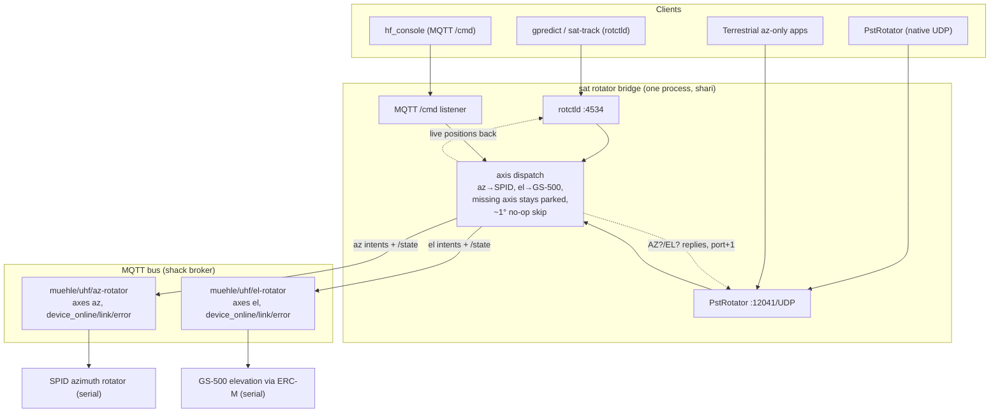
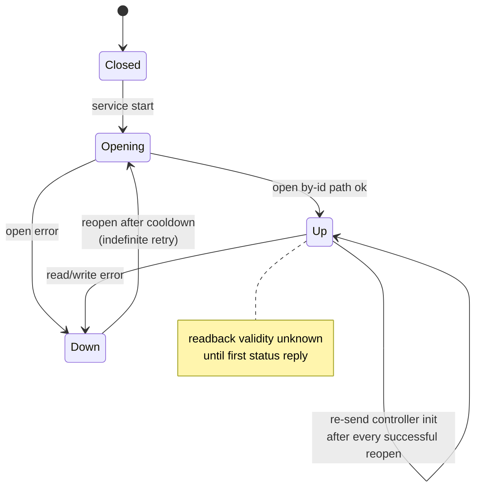

# Sat-Ops Rotators and Polarization - Plan

## Goal Capsule

- **Objective:** Bring the new satellite antenna system online in the station model — SPID azimuth + GS-500 elevation (via ERC-M) rotators with rotctld/PstRotator emulation for external clients, and live X-Quad polarization switching — so sat trackers, terrestrial az-only clients, and hf_console can all steer it.
- **Product authority:** `docs/station-integration-model.md` slot conventions plus the operator's brainstorm decisions (2026-09-12), recorded in Key Decisions below.
- **Open blockers:** none — the SPID (Rot1Prog) and ERC-M (GS-232B) wire protocols are pinned at planning from hamlib and the vendor manuals (see Appendix); remaining unknowns are bench-verification items, not planning blockers. PLC #2's first flash is physical USB (pre-OTA firmware) — a Tier-2 shipping dependency, not a blocker.

---

## Product Contract

> **Product Contract preservation:** changed: Goal Capsule open-blockers line (serial protocols pinned at planning), Sequencing note (hf_console rotator surface moved to Tier 1, user-affirmed at the planning scoping gate), Dependencies/Assumptions and Outstanding Questions resolved in place after research. All R/F/AE/KD content and IDs unchanged.

### Summary

A new Go bridge fronts the two sat rotator serial devices and publishes two honest per-axis slots (`muehle/uhf/az-rotator`, `muehle/uhf/el-rotator`), running a rotctld TCP server and a PstRotator UDP listener in-process that dispatch azimuth to the SPID and elevation to the GS-500. The ESPHome phase controller (`xphasectrl.yaml`) implements the already-declared `muehle/uhf/pol-ctrl` slot with one shared h/v/cl/cr setting for both X-Quads. The existing PTS pan/tilt head (pelcobridge2, `muehle/uhf/rotator`) is untouched and coexists.

### Problem Frame

The UHF station gained sat-ops hardware: an azimuth rotator (SPID) and an elevation rotator (GS-500 via an ERC-M interface), both serial/USB, carrying co-mounted 2m and 70cm X-Quads whose polarization phase is relay-switchable. The station model has no slots for these devices, and the tracking clients that must drive them (gpredict, SatPC32-class apps via hamlib rotctld, PstRotator, the hf_console tablet, plus terrestrial az-only software for SSB/repeater/contest work) each speak different protocols and assume a single rotator. Without protocol emulation, none of these clients can steer the mount; without slots, the antennas are invisible to the bus and to console/HADiscovery consumers.

### Key Decisions

- **Coexist, not replace.** The sat rotator pair is a new antenna-positioning system alongside the PTS-303Z/3050DZ pan/tilt head. `muehle/uhf/rotator` and pelcobridge2 stay untouched. (session-settled: user-directed — chosen over replacing/reusing the PTS head: the PTS head remains a separate positioner)
- **Two honest per-axis slots, one bridge process.** `uhf/az-rotator` (SPID) and `uhf/el-rotator` (GS-500 via ERC-M), each with its own `device_online`, `link`, and `error`, because the two serial ports are independent failure domains — a dead elevation port must not mark azimuth offline or vice versa. Chosen over a single combined slot (one `device_online` boolean would lie in both directions) and over per-device bridges + a gateway component (highest carrying cost, synthesized stale client positions). The bridge is one process serving both slots. (session-settled: user-approved — chosen over combined-slot and gateway alternatives: slot-model honesty at near-minimal carrying cost)
- **One endpoint per protocol, dispatch by axis.** Every client population hits the same rotctld server and the same PstRotator listener; commands route az → SPID, el → GS-500. A command carrying only azimuth moves the SPID and leaves the GS-500 parked — terrestrial az-only clients (SSB, repeater, contesting) and sat az+el clients share the endpoints. (session-settled: user-directed — chosen over separate per-axis endpoints: one client wiring serves both populations)
- **No arming — free motion.** Unlike pelcobridge2 (manual arming, MQTT `/cmd` limited to `stop`), any connected client — rotctld, PstRotator, or console — may move the sat rotators. Safety is procedural (operator watching), not software-enforced; a pre-deploy exposure review (broker ACLs, bind scope, firewalling) is part of the deliverable because any LAN client reaching the ports can slew real antennas. (session-settled: user-directed — chosen over an arming gate or lightweight gating)
- **Polarization: build it now, one shared setting.** The X-Quad phase controller is an M5 Stamp PLC running ESPHome (`xphasectrl.yaml`, currently untracked at repo root); it implements the model-declared `muehle/uhf/pol-ctrl` slot directly over MQTT (the waveshare ant-switch pattern — firmware is the bridge, no Go component). One setting applies to both the 2m and 70cm X-Quads together; polarization remains operator-driven with no automatic binding. This closes the known issue that the pol-ctrl slot was unimplemented. (session-settled: user-directed — chosen over model-only/defer or out-of-scope)
- **Protocol ports on shari: rotctld 4534, PstRotator UDP 12041.** 4533 is pelcobridge2's rotctld on shack-pc and 12040 is wrc-rotator-bridge's PstRotator listener on shari; the distinct 4534 prevents a client pointed at "the rotator" from silently reaching the wrong antenna system. (session-settled: user-approved — part of the chosen approach)
- **Axis-liveness refusal instead of silent queueing.** The rotctld refusal code that pelcobridge2 uses for "disarmed" is repurposed as an axis-liveness refusal: motion toward a dead port (per the two-layer liveness rule — `/status` AND `device_online`) is refused to the client, not queued. The PstRotator path logs the equivalent. (session-settled: user-approved — grafted onto the chosen approach at the approach review)
- **Anti-chatter dispatch and shared-code path.** A config-bounded no-op skip (target within ~1 degree of cached readback skips the serial write) keeps unattended passes from hammering unproven hardware; the rotctld and PstRotator implementations are written against a narrow mount-controller interface with a scheduled promotion to `shared/` (station convention 9) when a component beyond this bridge adopts the interface (a pelcobridge2 refactor or a future component), so the private copy of pelcobridge2's proven dialect is temporary by design. (session-settled: user-approved — grafted onto the chosen approach at the approach review)

### Requirements

**Sequencing (within this workstream):** Tier 1 ships first — the rotator bridge and protocol emulation (R1–R12, flows F1/F2/F4, AE1–AE3, AE5), the integration-model slot entries, and the hf_console rotator steering surface including its STOP button. Tier 2 — polarization (R13–R15), the hf_console polarization control, and the known-issues closure — follows, sequenced behind the PLC #2 physical USB flash (pre-OTA firmware). Polarization is built in this workstream per the settled decision; only its shipping dependency is decoupled.

**Rotator slots and telemetry**

- R1. Two new device slots exist under the `uhf` station segment: `muehle/uhf/az-rotator` (SPID azimuth, role `rotator`, capabilities `axes ["az"]` with configured SPID travel limits) and `muehle/uhf/el-rotator` (GS-500 via ERC-M, role `rotator`, capabilities `axes ["el"]` with configured GS-500 limits), each publishing the four planes per `docs/station-integration-model.md` §8.1.
- R2. Each slot reports its own `device_online`, `link`, and `error` in a single retained `/state` snapshot (position, target, moving included), so one dead serial port takes only its own axis offline.
- R3. Each slot's `/cmd` accepts `goto` with the argument under `value` (degrees) and `stop` — free motion, no arming gate, per the station `/cmd` value-key convention.
- R4. Motion initiated from any control path (protocol servers or MQTT `/cmd`) surfaces in both slots' `/state`, so hf_console and hadiscovery see protocol-driven moves like bus-driven ones.
- R5. Each axis's serial port self-heals independently: a read/write error triggers a reopen of the `/dev/serial/by-id/` path after a short cooldown, and while the port is down that slot reports `device_online false` with `/status` staying online (two-layer liveness rule).

**Protocol emulation and dispatch**

- R6. A rotctld TCP server presents one combined AzEl rotator (Hamlib dialect as field-proven by pelcobridge2: `p`, `P`, `S`, `_`, `\dump_state` with configured limits, `q`; error codes per contract), on port 4534 on shari.
- R7. A PstRotator native UDP listener on port 12041 on shari accepts the datagram set already served by wrc-rotator-bridge (`<PST><AZIMUTH>…</AZIMUTH>[<ELEVATION>…</ELEVATION>]</PST>`, `<STOP>1</STOP>`, `AZ?` and `EL?` position queries with replies on the source IP at port+1) and, unlike wrc, honors `<ELEVATION>` for both commands and `EL?` readback (bench-verified against a real PstRotator instance). `<PARK>` is implemented per PstRotator protocol semantics: both axes slew to their configured park positions (park azimuth and park elevation, default 0°) via the normal dispatch paths.
- R8. Dispatch is purely by axis: azimuth arguments reach only the SPID, elevation arguments only the GS-500. A wire message that structurally omits one axis (a PstRotator datagram without `<ELEVATION>`, an MQTT `/cmd` on a single-axis slot) leaves that axis parked wherever it is; a rotctld `P` command always carries both axes and therefore dispatches both (R12's deadband skip is the only no-op case — hamlib az-only clients on rotctld pass `0.0` elevation per the man page, Appendix D, so a `0.0` el target dispatches normally and elevation slews to 0°/park unless already within deadband). `stop` from any path halts both axes.
- R9. Motion toward an axis whose two-layer liveness check fails (bridge `/status` offline or that slot's `device_online` false) is refused to the client, never silently queued or dropped.
- R10. Targets outside an axis's configured travel limits are refused on every command path (rotctld `P`, PstRotator datagram, MQTT `/cmd`) using the same client-facing refusal mechanism as R9, before any serial write. The no-auth posture governs who reaches the ports, not what magnitudes pass through.
- R11. Motion commands coalesce latest-wins per axis: at most one in-flight serial motion command per axis, and a newer target supersedes any queued one, so a fast pass cannot build a stale backlog behind slower hardware.
- R12. A config-bounded no-op skip: a target within the configured deadband (default ~1 degree) of the axis's cached readback skips the serial write, keeping unattended passes from hammering unproven hardware.



**Polarization**

- R13. The ESPHome phase controller implements the declared `muehle/uhf/pol-ctrl` slot four-plane over MQTT directly (retained `/meta` birth certificate with role `pol-ctrl` and `polarizations [h, v, cl, cr]`, retained `/state` snapshot, LWT `/status`, `/cmd` subscription), following the waveshare ant-switch pattern.
- R14. `/cmd` `set_pol` with `value` in `h|v|cl|cr` sets one shared polarization for both X-Quads; the retained `/state` reports it. The controller's existing interlock holds: a phase change de-energizes all phase relays before energizing the new one, never two at once. (The YAML drives three relays — horizontal, circular-left, circular-right on the AW9523 — with vertical as the all-relays-off state; canonical names map to the select's `Horizontal`, `Vertical`, `Circular Left`, `Circular Right`.)
- R15. Polarization stays operator-driven: no component binds polarization to band, tracking, or any automatic policy.

**Console and documentation**

- R16. hf_console can steer both axes (`goto`/`stop` on each rotator slot) and set polarization (`set_pol`) over `/cmd`, reading the two sibling rotator slots and pol-ctrl; it already subscribes `muehle/#` and publishes `/cmd`, so no transport change is needed — only the sat-ops surface.
- R17. `docs/station-integration-model.md` gains the two rotator slot entries (with the two-device `device_online` wording for the one-process-two-slots shape); all three stale "shack-pc hosts PSTRotator (SPID)" references are rewritten to the new system, naming pelcobridge2 and the PTS pan/tilt head — the host-table row "PSTRotator (serial) | `uhf/rotator` (SPID) | shack-pc" plus the §10 host-loss bullet and the §11 resolved-residual item; the `docs/known-issues.md` "PLC #2 firmware does not exist" entry is closed when the phase controller is live.

### Key Flows

- F1. Sat client tracks a pass
  - **Trigger:** gpredict (or PstRotator) sends an az+el position update during a pass.
  - **Actors:** rotctld/PstRotator server, axis dispatch, SPID, GS-500.
  - **Steps:** Server parses both axes; dispatch routes az to the SPID driver and el to the ERC-M driver; within-deadband targets skip the serial write; resulting positions flow back to the client (`p` reply, `AZ?` reply) and into both slots' retained `/state`.
  - **Outcome:** The mount follows the client's updates; the bus sees the same motion any consumer would see. **Covers R4, R6–R8, R12.**
- F2. Terrestrial az-only client steers
  - **Trigger:** A contesting/SSB app sends an azimuth-only command — a PstRotator datagram without `<ELEVATION>`, or an MQTT `goto` on the az-rotator slot. (rotctld `P` cannot structurally omit elevation: hamlib az-only clients there pass `0.0` per the man page, Appendix D, so the rotctld path is not az-only in effect — the `0.0` el target dispatches normally and elevation slews to 0°/park unless within deadband, per R8.)
  - **Actors:** Same endpoints as F1.
  - **Steps:** No elevation intent is constructed; the GS-500 stays parked wherever the last pass left it.
  - **Outcome:** Azimuth moves; elevation untouched. **Covers R8.**
- F3. Operator sets polarization
  - **Trigger:** hf_console publishes `set_pol` to pol-ctrl `/cmd` (or the phase select is driven locally).
  - **Actors:** ESPHome phase controller, X-Quads.
  - **Steps:** `/cmd` maps to the select; the interlock de-energizes all phase relays then energizes the new phase; the retained `/state` republishes.
  - **Outcome:** Both X-Quads share the new phase. **Covers R13–R16.**
- F4. Axis dies mid-operation
  - **Trigger:** The ERC-M serial port is unplugged mid-pass.
  - **Actors:** Bridge, rotctld client, hf_console.
  - **Steps:** The el reader self-heals (reopen on error, cooldown, R5) and `el-rotator` reports `device_online false` while `/status` stays online; subsequent motion on the dead axis is refused to the client (R9); azimuth continues to work and `az-rotator` stays fully online.
  - **Outcome:** One dead port degrades exactly one axis; clients are told, not stalled. **Covers R2, R5, R9.**

### Acceptance Examples

- AE1. **Covers R6, R8.** Given both rotators online, when a rotctld client sends `P 180.5 45.0`, then the SPID slews to 180.5°, the GS-500 to 45.0°, `RPRT 0` is returned, and a following `p` reports both live positions.
- AE2. **Covers R7, R8.** Given the mount at rest, when PstRotator sends `<PST><AZIMUTH>200</AZIMUTH></PST>` (no elevation), then azimuth moves to 200° and elevation stays at its previous position.
- AE3. **Covers R2, R9.** Given the ERC-M port dead (`el-rotator` `device_online` false, `/status` online), when a client sends `P 90.0 30.0`, then the elevation intent is refused with the liveness refusal code and azimuth still moves to 90°.
- AE4. **Covers R13, R14.** Given the phase controller online, when `set_pol` with `value: cl` is published, then `/state` reports `pol: "cl"`, both X-Quads are circular-left, and no phase change ever energizes two phase relays simultaneously.
- AE5. **Covers R10–R12.** Given a simulated fast pass commanding several position updates per second, when the bridge receives a burst of targets beyond the hardware's slew rate, then at most one serial motion command per axis is in flight at a time, the mount always moves toward the newest target (within-deadband targets skip the write), and position lag stays within the configured bound for the duration of the simulated pass.

### Scope Boundaries

- Radio Doppler / satellite uplink-downlink frequency control — out of scope; this workstream is rotators and polarization only.
- A merged logical sat-rotator slot on the bus — deliberately not built; consumers wanting a combined az+el view get it from the protocol endpoints. Escape hatch: if console dual-slot wiring proves costly or pass-scheduling policy later emerges, add a merged logic slot then, following the antennaselect/powerseq precedent.
- pelcobridge2 and the PTS pan/tilt head — untouched, no shared code hoisted from it in this workstream (promotion to `shared/` is scheduled for when a consumer beyond this bridge adopts the interface).
- Pass scheduling and automatic park policies (e.g. auto-park elevation between passes) — not built; the manual PstRotator `PARK` command (R7) is implemented per protocol semantics.

### Dependencies / Assumptions

- The 2m and 70cm X-Quads are co-boresighted on the one az/el mount: one pointing serves both bands, no per-band aim. **Assumption — affirmed in dialogue.**
- The bridge (and both serial devices) deploy to shari; pelcobridge2 keeps its rotctld on shack-pc. **Assumption — deployment detail for planning.**
- SPID (Rot1Prog) and ERC-M (GS-232B) wire protocols are pinned at planning from hamlib and the DF9GR vendor manuals (Appendix); bench bring-up verifies the shack units' persistent settings (baud, protocol mode, controller variant).
- PLC #2's first flash is physical USB (pre-OTA firmware); subsequent updates can move to OTA.
- hf_console already subscribes `muehle/#` and publishes `/cmd`, so the sat-ops surface is additive there.
- The phase relays drive both X-Quads' phase lines together (paralleled wiring or pre-split switching) — to verify at the Tier 2 bench pass before acceptance testing.

### Outstanding Questions

**Blocking:** none.

**Deferred to bench bring-up:**

- SPID controller variant (Rot1Prog vs an MD-0x in ROT1 mode — frame-width mismatch shifts targets ×10) and its resolution/baud settings.
- ERC-M persistent settings: baud via `rBAU` probe (9600 vs 19200), protocol must read back GS232B (`rPRO`); GS-500 feedback voltage range fit; elevation calibration via the Service-Tool (multi-point, every 5°).
- PstRotator `AZ?`/`EL?` reply strings reconciled against the shack's installed version (official manual says `AZ:xxx.x`/`EL:yy.y`; the wrc precedent ships a `<PST><AZIMUTH>` shape) — default to the manual, confirm on the real instance per R7.
- rotctld version-sensitive details (unknown-command behavior, `\dump_state` trailing bytes) pinned against the hamlib release the shack's clients run.
- `/dev/serial/by-id/` identities on shari (seed-once at deploy); the udev template pins one USB vendor — two adapters may need two rules.
- X-Quad phase-relay wiring (shared relay set vs per-quad sets) — a Tier 2 hardware precursor; the one-shared-setting decision needs paralleled phase lines to be implementable.

### Sources / Research

- `docs/station-integration-model.md` — slot template, §8.1 adapter conformance checklist, `uhf/rotator` (:625–635), `uhf/pol-ctrl` (:640–641), X-Quad passive resources (:643–644), stale SPID host-table row (:671).
- `docs/known-issues.md:78–82` — pol-ctrl firmware known issue this plan closes.
- `pelcobridge2/CLAUDE.md`, `pelcobridge2/internal/rotctld/server.go`, `pelcobridge2/config.example.toml` — the byte-exact, gpredict-proven rotctld dialect to replicate (port 4533 on shack-pc).
- `wrc-rotator-bridge/CLAUDE.md`, `wrc-rotator-bridge/docs/wrc-rotator-bridge-mqtt-api.md`, `wrc-rotator-bridge/config.example.toml` — in-bridge legacy protocol server precedent; PstRotator datagram set and reply-on-port+1 convention (UDP 12040 on shari).
- `waveshare_relay-antswitch-bridge/esphome/station-at1.yaml` — ESPHome-direct four-plane slot pattern for pol-ctrl.
- `xphasectrl.yaml` (repo root, untracked) — existing polarization select with all-off-then-one-on relay interlock; three phase relays, vertical = all-off.
- `shared/schema/schema.go` — `SiblingTopic`, `CmdPayload` value-key convention; `shared/mqtt/mqtt.go` — Connect/Enqueue/RunJobs plumbing.
- Verified 2026-09-12: no SPID/GS-500/ERC-M implementation code exists in the repo; slot names `uhf/az-rotator` and `uhf/el-rotator` are free; on shari UDP 12040 and TCP 7373 are taken (wrc-rotator-bridge), 4533 is taken only on shack-pc.
- Planning-time protocol pinning (SPID Rot1Prog, ERC-M GS-232B, PstRotator UDP, rotctld) with primary sources — see Appendix.

---

## Planning Contract

### Key Technical Decisions

**Component and deployment**

- **KTD1. Component and module: `spid-ercm-rotator-bridge` (hyphenated).** Fits `docs/conventions/naming.md` `<devtag>-<function>-bridge`; the underscore working name is a recorded deviation shape. One Go module at `spid-ercm-rotator-bridge/`, added to the root `go.work`, importing `shared/` via the standard `require` + `replace ../shared`. The systemd EnvironmentFile prefix follows naming.md's derivation (dir name uppercased, hyphens → underscores): `SPID_ERCM_ROTATOR_BRIDGE_MQTT_PASSWORD`. (session-settled: user-approved — affirmed at the planning scoping gate; hyphenated over the underscore working name: naming-convention fit)
- **KTD2. One process, two slots, two MQTT clients.** Mirror the shelly-power-bridge `[[slot]]` shape: each fronted slot gets its own paho client with its own retained-LWT `/status`, so process death takes both slots offline with no stale-online gap while a dead serial port degrades only its own slot. (inherits the brainstorm two-slots-one-bridge decision — session-settled: user-approved)
- **KTD3. A new systemd hardening combination.** Serial access forbids `PrivateDevices` (atr1k's otherwise-newest template is unusable here): ultrabridge's `SupplementaryGroups=dialout` + `DeviceAllow=char-ttyUSB/ttyACM` + udev rule, plus atr1k's remaining hardening with `MemoryMax`/`TasksMax`, plus wrc's `RestrictAddressFamilies=AF_INET AF_INET6` for the inbound TCP/UDP listeners. Two USB-serial adapters may need two udev rules — the repo template pins one vendor ID.
- **KTD4. Expose and exposure posture.** Both listeners bind 0.0.0.0 (LAN clients: gpredict/PstRotator on shack PCs and workstations); the no-auth posture is accepted (inherits the brainstorm decision — session-settled: user-directed). The rotator slots publish **read-only** `expose` blocks so hadiscovery renders state but no HA motion widgets, and the shack↔HA bridge's inbound `muehle/+/+/cmd` forwarding is accepted as-is — any house-network MQTT client can command motion, which is the reviewed no-arming posture made concrete. The pre-deploy exposure review enumerates all five vectors (rotctld TCP :4534 unauthenticated; PstRotator UDP :12041 unauthenticated + source-spoofable; HA-bridge inbound `/cmd` accepted; console account scope; **console e-stop unavailability** — during a shack-broker outage or tablet `linkUp` loss the protocol listeners retain full motion authority while the console STOP, the operator's designated e-stop, is down) with per-vector accept/mitigate decisions recorded in the docs register. The e-stop vector is accepted with a documented physical fallback: the station master mains switch (`muehle/power/master` / the physical breaker) is the sanctioned halt of last resort. The Tier-1 five-vector review is rotator-scoped; the register is extended at Tier 2 with the phase controller's own device surfaces (web_server, OTA, native API on PLC #2) as a sixth enumerated vector with an accept/mitigate decision, recorded before the PLC #2 flash (U10) — the exposure review that gates a deploy covers every surface that deploy introduces. (session-settled: user-approved — affirmed at the planning scoping gate; read-only exposes + accepted HA path over bridge-ACL narrowing: consistent with the no-arming posture)

**Serial drivers**

- **KTD5. SPID driver speaks the Rot1Prog binary protocol.** Pinned from hamlib `rotators/spid/spid.c` and the LA6YKA protocol spec (Appendix A): 13-byte frames, 1200 baud 8N1 fixed, command digits ASCII-out but reply digits **raw byte values** (the classic desync trap), set commands get no reply, az-only. The bridge owns the poll cadence (~1 s, config-bounded) and paces writes ≥300 ms apart. Bench pinning: confirm the shack controller is a Rot1Prog and not an MD-0x in ROT1 mode.
- **KTD6. ERC-M driver speaks the GS-232B dialect.** Pinned from the DF9GR (schmidt-alba.de) manuals (Appendix B): goto via `W`, readback via `C2`/`B`, stop via `S`/`E`, 9600 8N1 typical (bench-probe `rBAU`; protocol must read GS232B via `rPRO` — DCU-1 mode is azimuth-only and cannot carry the GS-500 elevation axis). Firmware version `rFMW` feeds `/meta`. Elevation calibration (multi-point, every 5°) is Service-Tool bench work — the bridge never re-calibrates; it reads positions only.
- **KTD7. Serial self-heal: reopen by-id, retry indefinitely, re-init after reopen.** Ultrabridge's opener-closure model (re-resolve the stable `/dev/serial/by-id/` symlink; one retry per call; the poll loop retries later) with pelcobridge2's reader-generation tagging so stale-goroutine errors are ignored; never give up permanently. After every successful reopen, re-send any controller initialization (the device may have power-cycled). An empty configured serial path selects the in-process mock device so the whole stack runs bench- and CI-side without hardware. Every `Down` transition clears that axis's cached-readback validity and `moving`, so post-reopen behavior is always-write until the first fresh status reply — the deadband can never silently no-op against a pre-outage stale position.

**Dispatch and refusal**

- **KTD8. Global per-axis latest-wins, one in-flight per axis, stop is a bounded epoch.** All control paths interleave with uncoordinated latest-wins per axis — a terrestrial client can intentionally steal azimuth from a running pass; that is the accepted consequence of one endpoint per protocol. `stop` from any path clears every pending target on both axes, cancels the in-flight intent, and halts both axes (pelcobridge2 queue-cancel precedent; wrc stop-beats-azimuth datagram precedence). The epoch's suppression is bounded to intents admitted before the stop: an intent arriving after the stop is admitted normally — free motion resumes on any client's next target, consistent with the no-arming decision. Recorded consequence (KTD4 register): an operator STOP against a live tracker is transient; the durable halt is closing the tracking client or the physical fallback. `PARK` is an atomic mount-level intent whose stop-then-park phases bypass the suppression relation (KTD11). Deadband compares against cached readback; an unknown readback never skips (always write).
- **KTD9. Refusal semantics are evaluated locally.** R9's two-layer check is evaluated by the bridge itself: its own `/status` is online while the process runs, so a broker outage degrades telemetry publishing, not motion authority — a running bridge keeps steering a live pass with live serial axes. Per-axis `device_online` false refuses that axis. Travel-limit targets are refused on every path before any serial write (R10). A rotctld `P` returns a single RPRT for the whole command — `RPRT -9` liveness refusal, `RPRT -1` invalid/limits — so a partially-refused two-axis command reads as failure to the client (gpredict-class clients treat nonzero as total failure and retry; accepted deliberately). Before the first successful readback, position queries return `RPRT -11` (never a fabricated position).

**Protocol servers**

- **KTD10. rotctld is a byte-copy of pelcobridge2's field-proven dialect, wire-table-pinned.** `p` → two `%.2f` lines with no RPRT trailer; `P` parses both arguments (NaN/inf refused up front) and dispatches once per axis; `\dump_state` protocol v1 with configured limits and `done`; `q` closes; 2 s per-call timeout; `RPRT 0/-1/-4/-6/-9/-11` vocabulary. Version-sensitive divergences from hamlib master (unknown-command silence, `done` trailing bytes) are bench-pinned against the hamlib release the shack's clients actually run. (inherits the brainstorm protocol decision — session-settled: user-approved)
- **KTD11. PstRotator replies per the official manual, bench-reconciled.** `AZ?`/`EL?` replies officially are `AZ:xxx.x` / `EL:yy.y` (one decimal) sent to the source IP at listen-port+1 — a different shape than wrc's `<PST><AZIMUTH>…` reply; the real-instance bench pass mandated by R7 reconciles which string the shack's PstRotator version expects, defaulting to the manual. `PARK` arrives as `<PST><PARK>1</PARK></PST>` and dispatches as one atomic mount-level intent (KTD8): its stop phase cancels the queue, then both park targets dispatch via normal paths (deadband applies, so an already-parked axis is a no-op). The parser is tag-tolerant: datagrams may batch commands; `STOP` takes precedence over `AZIMUTH` in the same datagram; no reply datagram for motion commands (none is documented).
- **KTD12. Two-layer control boundary — per-axis Controller + mount façade; `shared/` promotion deferred by design.** U2/U3 satisfy a per-axis `Controller` interface (set-target, stop, readback+validity, online — the wrc shape), and a mount façade above it owns every cross-axis semantic: atomic stop with the bounded epoch (KTD8), two-axis refusal aggregation into the single client reply (KTD9), and park dispatch (KTD11). rotctld, PstRotator, and the MQTT `/cmd` path all consume the façade and must not re-implement cross-axis semantics — the duplication this KTD exists to prevent is exactly three server-local variants of stop/refusal/park logic, which the scheduled `shared/` promotion would then bake in. The private copy of pelcobridge2's dialect is temporary by design. (inherits the brainstorm decision — session-settled: user-approved: promotion when a consumer beyond this bridge adopts the interface)

**Bus posture**

- **KTD13. Rotator `/cmd` is one-shot: non-retained, QoS-0 subscription, cleared anyway.** Rotator `goto`/`stop` are one-shot motion intents in §8's one-shot class: published non-retained, subscribed at QoS 0 (no broker offline backlog can queue behind the bridge), cleared with an empty publish after execute-or-reject (the empty-payload echo guard), `ts`-gated when stamped, unstamped payloads tolerated (existing console publishers stamp none). A stale retained or queued `goto` must never replay — the 2026-09-03 ultrabridge incident pattern, with real antennas behind it and no arming gate. Contrast pol-ctrl: polarization is settable steady state and stays retained (the ant-switch actuator exception), self-healing after a controller reboot.
- **KTD14. `/state` cadence: poll tick, dedup, change/edge republish, always-fresh `ts`.** The ultrabridge pattern — fixed readback poll per axis, snapshot dedup before publish, republish on change and liveness edges — avoiding both the publish-per-tick firehose during a pass and the change-only starvation that starved the pa-arm heartbeat live. `device_online` is always an explicit boolean. `moving` is inferred, never wire-reported (neither protocol carries a busy flag): per axis `moving = |target − readback| > deadband`, false while readback validity is unknown (KTD7), cleared on stop. Readback quantization bounds what the deadband means per axis (Rot1Prog whole degrees; ERC-M on a 5°-calibrated 10-bit ADC) — the elevation deadband is expected to need bench loosening from the ~1° default.

**Firmware**

- **KTD15. The phase controller's state is derived from relay readback, never echoed from commands.** Fixes the current YAML's boot lie (relays `ALWAYS_OFF` boots vertical while the optimistic select claims the last phase): `/state` derives from the AW9523 relay states per the waveshare pattern, and local changes (Button A cycle) converge to the bus. The FlexRadio power relay on pin 3 stays outside the pol-ctrl contract. `set_pol` rejects invalid values with explicit error feedback — the rejection is published into the retained `/state` error field (cleared on the next valid state change) so the console faults bar and any bus consumer sees it, in addition to any on-device display indication (no silent drops, unlike the ant-switch firmware) — type-checks the JSON value (the m5stamp boolean-string trap), keeps the all-off-then-one-on interlock with vertical as all-off, and — per KTD13 — retains `set_pol` as steady state.

### High-Level Technical Design

Every control path feeds the same dispatch pipeline; the pipeline is the only writer to the serial ports:

```mermaid
flowchart TB
  RC["rotctld TCP :4534"]
  PST["PstRotator UDP :12041"]
  CMD["MQTT /cmd (per-slot, QoS 0)"]
  PARSE["parse: which axes does the wire message carry?"]
  LIVE{"axis liveness<br/>(local view: process up AND<br/>axis device_online)"}
  LIM{"travel limits"}
  DB{"deadband vs<br/>cached readback<br/>(unknown ⇒ always write)"}
  CO["latest-wins coalescer<br/>(one in-flight per axis)"}
  STOPQ["stop: cancel all pending,<br/>halt both axes"]
  SER["serial write<br/>(SPID frame / ERC-M W)"]
  POLL["readback poll (~1 s per axis)"]
  STATE["/state snapshots<br/>(dedup + edges, both slots)"]
  REPLY["client replies<br/>(RPRT / AZ: / p lines)"]
  RC --> PARSE
  PST --> PARSE
  CMD --> PARSE
  PARSE --> LIVE
  LIVE -->|"refuse (R9)"| REPLY
  LIVE -->|"pass"| LIM
  LIM -->|"refuse (R10)"| REPLY
  LIM --> DB
  DB -->|"within deadband: no-op"| REPLY
  DB --> CO
  CO --> SER
  STOPQ --> CO
  PARSE -->|"stop from any path"| STOPQ
  SER --> POLL
  POLL --> STATE
  POLL -.->|"cached readback"| DB
  POLL -.->|"live positions"| REPLY
  STATE -->|"moving / position"| REPLY
```

Each serial port runs an independent health state machine; readback validity starts unknown:



The bridge reuses the Product Contract's component diagram (above) for topology; these two diagrams cover the pipeline and the failure model that prose alone would leave ambiguous.

### Sequencing

- Tier 1 (U1–U9): scaffold → drivers (SPID, ERC-M) → dispatch core → MQTT slot surface → rotctld → PstRotator → console rotator surface → docs/exposure review. U2/U3 are parallel after U1; U5/U6/U7 are parallel after U4; U8 follows U5; U9 lands with the deploy.
- Tier 2 (U10–U11): phase controller component → console polarization surface + known-issues closure. Behind the PLC #2 physical USB flash (a deployment dependency, not a U-ID).
- The shari deploy is gated on the exposure review being recorded (U9) — the settled decision makes the review part of the deliverable, so it lands before the listeners go live.

---

## Implementation Units

| U | Title | Key files | Depends |
|---|---|---|---|
| U1 | Scaffold module, config, deploy | `spid-ercm-rotator-bridge/` | — |
| U2 | SPID Rot1Prog serial driver | `internal/spid/` | U1 |
| U3 | ERC-M GS-232B serial driver | `internal/ercm/` | U1 |
| U4 | Mount dispatch core | `internal/mount/` | U2, U3 |
| U5 | Two-slot MQTT surface | `internal/mqttslot/` | U4 |
| U6 | rotctld TCP server | `internal/rotctld/` | U4 |
| U7 | PstRotator UDP server | `internal/pstrotator/` | U4 |
| U8 | hf_console rotator surface | `hf_console/lib/` | U5 |
| U9 | Station docs + exposure review | `docs/`, root `CLAUDE.md` | U5 |
| U10 | Phase controller component | `m5stamp-pol-ctrl/` | — (Tier 2) |
| U11 | Console pol surface + closure | `hf_console/lib/`, `docs/known-issues.md` | U8, U10 |

### U1. Scaffold `spid-ercm-rotator-bridge` module, config, and deploy

- **Goal:** A building, deployable module skeleton — config parsing, two-slot config shape, seed-once deploy, hardened systemd unit — with no device behavior yet.
- **Requirements:** Enables R1; conventions 3 (0600 TOML), 5 (hardened unit), 8 (naming).
- **Dependencies:** none.
- **Files:** `spid-ercm-rotator-bridge/go.mod`, `spid-ercm-rotator-bridge/cmd/spid-ercm-rotator-bridge/main.go`, `spid-ercm-rotator-bridge/internal/config/config.go`, `spid-ercm-rotator-bridge/internal/config/config_test.go`, `spid-ercm-rotator-bridge/config.example.toml`, `spid-ercm-rotator-bridge/deploy.sh`, `spid-ercm-rotator-bridge/CLAUDE.md`, `go.work` (add module). Systemd unit + udev rule per `docs/conventions/deployment.md:66-96` (deploy.sh installs them).
- **Approach:** Module name = dir name with `require codeberg.org/kgbvax/stationa/shared` + `replace … => ../shared` (KTD1). Config TOML: `[mqtt]` (broker `tcp://127.0.0.1:1883`, site/station from config — never constants in code), `[[slot]]` for az and el (slot name, device model string, link `serial`), per-axis serial tables (`port` = `/dev/serial/by-id/…`, `baud` 1200/9600, empty port ⇒ mock per KTD7), `[rotctld]` (bind/port 4534), `[pstrotator]` (port 12041), `[control]` per-axis travel limits, deadband (default ~1°), park positions, poll interval, reopen cooldown.
- **Patterns to follow:** `atr1k-tuner-bridge/` scaffolding and deploy.sh (seed-once for config.toml **and** the EnvironmentFile); `shelly-power-bridge/config.example.toml` (`[[slot]]` two-slot shape); `acom1200s-pa-bridge/config.example.toml:16–21` (serial section — ultrabridge has no example TOML; its template is a heredoc in `ultrabridge/deploy.sh`); `docs/conventions/deployment.md` serial/systemd snippets (KTD3).
- **Test scenarios:** example TOML parses with both slots and all defaults applied; missing slot rejected; empty `port` selects mock mode; MQTT password only via env (`SPID_ERCM_ROTATOR_BRIDGE_MQTT_PASSWORD`), never parsed from TOML or flags.
- **Verification:** `go build ./...` and `go test ./...` pass from the component dir without the workspace; root `go work sync` clean.

### U2. SPID Rot1Prog serial driver

- **Goal:** Azimuth-only SPID driver: open, poll status, goto, stop, mock mode, indefinite self-heal.
- **Requirements:** Advances R1, R2, R5, R12 (readback cache feeding the deadband); F4 (self-heal side).
- **Dependencies:** U1.
- **Files:** `spid-ercm-rotator-bridge/internal/spid/spid.go`, `internal/spid/frame.go`, `internal/spid/frame_test.go`, `internal/spid/spid_test.go`, `internal/spid/mock.go`.
- **Approach:** Rot1Prog framing per Appendix A (KTD5): 13-byte packets (`S=0x57`, ASCII digit fields, `K` = `0x2F` set / `0x1F` status / `0x0F` stop, `END=0x20`), 5-byte status reply with **raw** digit bytes, `az = H1*100 + H2*10 + H3 − 360`; set commands expect no reply; poll on the configured tick; writes paced ≥300 ms. Reopen-by-id with cooldown, indefinite retry, generation tagging, re-init after reopen (KTD7). Readback validity flag is false until the first status reply (feeds KTD8's deadband rule and KTD9's `-11`).
- **Patterns to follow:** `ultrabridge/internal/ub/transport/device.go` + `device_reopen_test.go` (opener closure, reopen, fake serial); `pelcobridge2/internal/control/engine.go` (generation tagging, never-give-up reopen).
- **Test scenarios:** frame encode for az 123 matches the Appendix byte table; status reply decode (raw-digit trap pinned by a byte-exact fixture); poll populates cached readback and clears unknown; scripted read error → reopen → recovery on a later tick; stop packet uses `K=0x0F`; concurrent write+poll serialize; mock device satisfies the same interface for U4+ tests.
- **Verification:** all wire-level tests green against fake serial; no hardware required.

### U3. ERC-M GS-232B serial driver

- **Goal:** Elevation driver for the GS-500 behind the ERC-M, same driver contract as U2.
- **Requirements:** Advances R1, R2, R5, R12; F4 (the dead axis in that flow).
- **Dependencies:** U1.
- **Files:** `spid-ercm-rotator-bridge/internal/ercm/ercm.go`, `internal/ercm/ercm_test.go`, `internal/ercm/mock.go`.
- **Approach:** GS-232B dialect per Appendix B (KTD6): elevation goto via `W` carrying the current az + target el (exact spelling bench-pinned) — the driver caches the az each `C2` reply reports alongside el, and a `W` arriving with no cached az (post-start/post-reopen, pre-first-readback) is deferred until the next poll tick supplies one, never written with a fabricated az operand (this deferral is distinct from the deadband skip KTD7 forbids); readback via `C2` (`AZ=aaa  EL=eee` in B mode; tolerate the A-mode `+0aaa+0eee` shape), stop via `E`; `rFMW` read once at startup for `/meta` device firmware; `rBAU`/`rPRO` probing is bench-only, never at boot. Same self-heal, mock, and readback-validity rules as U2 (KTD7).
- **Patterns to follow:** U2's structure; reply parsing tolerant like `wrc-rotator-bridge` device parsing.
- **Test scenarios:** `W` command bytes; goto with no cached az deferred until the first `C2` supplies one (no fabricated operand written); `AZ=aaa  EL=eee` and `EL=eee` parses; `+0eee` fallback parse; `S`/`E` stop; scripted error → reopen; `rFMW` reply parsed into device firmware; mock device parity with U2's.
- **Verification:** wire-level tests green; bench-only settings listed in the Appendix carry a `bench:` tag in the config example.

### U4. Mount dispatch core

- **Goal:** The shared per-axis pipeline every control path feeds: latest-wins coalescing, deadband, limit refusal, liveness refusal, stop semantics.
- **Requirements:** R8, R9, R10, R11, R12.
- **Dependencies:** U2, U3.
- **Files:** `spid-ercm-rotator-bridge/internal/mount/mount.go`, `internal/mount/dispatch.go`, `internal/mount/dispatch_test.go`.
- **Approach:** A per-axis `Controller` interface (set-target, stop, readback + validity, online) that U2/U3 satisfy, plus the mount façade above it owning every cross-axis semantic — atomic stop with the bounded epoch, refusal aggregation, park dispatch (KTD12). One in-flight serial motion per axis; a newer target supersedes any queued one; stop clears every pending target on both axes and cancels the in-flight intent, while intents arriving after the stop are admitted (bounded epoch, KTD8). Deadband vs cached readback, unknown ⇒ always write. Limit refusal before any serial write (R10). Liveness refusal from the local two-layer view (KTD9). Park targets ride the normal dispatch paths (R7).
- **Patterns to follow:** pelcobridge2's one-intent queue discipline; wrc's narrow `Controller` interface shape (`wrc-rotator-bridge/internal/gs232/server.go:30`).
- **Test scenarios:** Covers AE5 — burst of targets beyond slew rate yields one in-flight per axis, newest-target-wins, within-deadband skips; Covers AE3 (logic side) — dead el axis refuses while az proceeds; limit refusal per axis before write; structurally-omitted axis untouched; stop clears every queued target on both axes and cancels the in-flight intent, while a post-stop intent is admitted (bounded epoch, KTD8); PARK's stop phase cancels the queue and its park targets then dispatch (no self-suppression); reopen after error ⇒ validity unknown ⇒ a within-deadband target still writes; deadband boundary at exactly the configured value; unknown readback never skips.
- **Verification:** pure unit tests over fake controllers; no I/O.

### U5. Two-slot MQTT surface

- **Goal:** Four-plane MQTT for both rotator slots per the §8.1 checklist, including `/cmd` one-shot posture and clean-shutdown liveness.
- **Requirements:** R1, R2, R3, R4, R5 (surfacing side).
- **Dependencies:** U4.
- **Files:** `spid-ercm-rotator-bridge/internal/mqttslot/slot.go`, `internal/mqttslot/slot_test.go`, `cmd/spid-ercm-rotator-bridge/main.go` (wiring both slots + servers).
- **Approach:** Two paho clients, one per slot, each with retained LWT `/status` and its own retained `/meta` birth certificate (role `rotator`, `axes`, device `{model: "SPID …"}` / `"GS-500 via ERC-M"` with `rFMW` firmware once read, link `serial`, host shari, read-only `expose` per KTD4). `/cmd` per KTD13: QoS-0 subscription, `goto` (`value` degrees) and `stop`, clear-after-execute-or-reject with the empty-payload echo guard, `ts` gate when stamped, unstamped tolerated — the gate rides a local cmd-struct extension (ultrabridge `internal/mqtt/client.go:95` precedent with rejection tests); `shared/schema.CmdPayload` carries only `Action`/`Value` and stays that way. `/state` per KTD14: single retained snapshot `{ts, az|el, target, moving, link, device_online, error}`, poll-tick dedup, change/edge republish. Handlers only Enqueue; `RunJobs` publishes (runtime-library REQ-RT rules). Clean shutdown self-publishes retained `offline` to both `/status` (powerseq pattern — the LWT does not fire on clean exit). Initial connect failure exits non-zero so systemd restarts.
- **Patterns to follow:** `shelly-power-bridge` per-slot clients; `wrc-rotator-bridge/internal/bridge/bridge.go` (`SetDeviceOnline` while `/status` stays online); `ultrabridge/internal/mqtt/client.go` (one-shot cmd rules, dedup publish); `powerseq` clean-shutdown pattern; `shared/mqtt` Connect/Enqueue/RunJobs.
- **Test scenarios:** MemoPublisher-style fake asserts retained `/meta` shape (§8.1: canonical role, capabilities, no site/station constants); `goto` routes to dispatch with the `value` key; invalid value rejected with an `error` state and the retained cmd still cleared; `device_online false` leaves `/status` online; protocol-driven motion appears in `/state` (R4 — dispatch events fed through the publisher); QoS-0 subscription asserted; reconnect republishes meta/state; `moving` inference per KTD14 (|target − readback| > deadband; false while validity unknown; cleared on stop) asserted per axis.
- **Verification:** unit tests green; §8.1 checklist walked manually against the published payloads.

### U6. rotctld TCP server

- **Goal:** The combined-AzEl rotctld endpoint on :4534, byte-compatible with the pelcobridge2-proven dialect.
- **Requirements:** R6, R8 (P always both axes), R9, R10.
- **Dependencies:** U4.
- **Files:** `spid-ercm-rotator-bridge/internal/rotctld/server.go`, `internal/rotctld/server_test.go`.
- **Approach:** Byte-copy pelcobridge2's dialect (KTD10): `p` → two `%.2f` lines from cached readback, no RPRT trailer; `P` → parse both args (NaN/inf refused), one dispatch per axis, single RPRT (`0` ok, `-1` invalid/limits, `-9` liveness refusal); `S` → stop both axes, `RPRT 0`; `_` → info line; `\dump_state` → protocol v1 with configured limits (`rot_model` default 901, `south_zero=0`, `rot_type=AzEl`) ending `done`; `q` closes; unknown → `RPRT -4`; 2 s per-call timeout; ctx-closed listener. Pre-readback `p` → `RPRT -11`, never a fabricated position (KTD9).
- **Patterns to follow:** `pelcobridge2/internal/rotctld/server.go` and its `server_test.go` wire-table test (TestWireTable) — keep the byte-exact pinning style.
- **Test scenarios:** Covers AE1 — `P 180.5 45.0` → `RPRT 0`, then `p` → `180.50\n45.00\n`; Covers AE3 — dead el axis → `RPRT -9` while az proceeds; `P` with one argument → `RPRT -1`; NaN/inf refused; `\dump_state` exact field order + `done`; pre-readback `p` → `RPRT -11`; `S` always `RPRT 0`; limit target → `RPRT -1` with no serial write; `q` closes the session.
- **Verification:** wire-table tests green; mock mode end-to-end (empty serial paths) drives `p`/`P`/`S` through U4 into the mock devices.

### U7. PstRotator UDP server

- **Goal:** The native-UDP endpoint on :12041 serving the PstRotator grammar with elevation honored.
- **Requirements:** R7, R8, R9, R10.
- **Dependencies:** U4.
- **Files:** `spid-ercm-rotator-bridge/internal/pstrotator/server.go`, `internal/pstrotator/server_test.go`.
- **Approach:** Grammar per Appendix C (KTD11): `<PST><AZIMUTH>…</AZIMUTH>[<ELEVATION>…</ELEVATION>]</PST>` dispatches the present axes only; `<STOP>1</STOP>` halts both axes and beats an azimuth tag in the same datagram; `<PST><PARK>1</PARK></PST>` slews both axes to configured park positions via normal dispatch; `<PST>AZ?</PST>` / `<PST>EL?</PST>` reply to the source IP at listen-port+1 with `AZ:xxx.x` / `EL:yy.y` (bench-reconciled per KTD11); tag-tolerant parser (batched commands, stray-space tolerance); no reply for motion datagrams.
- **Patterns to follow:** `wrc-rotator-bridge/internal/pstrotator/server.go` (regex grammar, stop precedence, port+1 reply addressing).
- **Test scenarios:** Covers AE2 — azimuth-only datagram moves az and leaves el untouched; el-carrying datagram dispatches el only; batched `STOP`+`AZIMUTH` → stop wins; `PARK` slews both axes to park positions (its stop phase does not suppress its own park slew); already-at-park → deadband no-op; `AZ?`/`EL?` reply to source IP at port+1 with the pinned strings; unknown tags ignored; limit and liveness refusals logged (R9's PstRotator-path logging).
- **Verification:** datagram-table tests green; mock-mode end-to-end.

### U8. hf_console rotator sat-ops surface

- **Goal:** The Tier-1 console surface: per-axis readouts, `goto`, and the STOP button — the operator's e-stop.
- **Requirements:** R16 (rotator half), R4 (consumer side), R3 payloads.
- **Dependencies:** U5 (slots live; mock mode acceptable for development).
- **Files:** `hf_console/lib/store/wiring.dart` (expectedSlots += `uhf/az-rotator`, `uhf/el-rotator`; `cmdRetain['muehle/uhf/az-rotator'] = false` and `cmdRetain['muehle/uhf/el-rotator'] = false` — the map has no `uhf/*` keys today and every consumer null-asserts on it, so the new panel crashes without them; non-retained `goto`/`stop` payload builders), `hf_console/lib/ui/widgets/sat_rotator_panel.dart` (new), `hf_console/lib/ui/screens/console_screen.dart` (tablet + phone layouts), tests under `hf_console/test/`.
- **Approach:** One panel for both axes, living on the existing UHF tab (replacing its "not yet wired" placeholder) as a single vertically scrolled panel column on both tablet and phone — the station-page pattern: az/el position, target, and moving indicator per axis; per-axis goto input — a decimal degree text field with ±1° steppers, validated client-side against the axis travel limits in `/meta` capabilities, publish disabled while the parsed value is empty or out of limits (bridge refusal per R10 remains the backstop via the faults surface); a prominent STOP. Per-axis controls gate on `slot.isOnline && store.linkUp` (two-layer AND — stale pre-sleep state must not render operable). The STOP is never disabled while any axis is operable: it publishes `{'action':'stop'}` non-retained to **both** rotator slots' `/cmd` topics on every tap, with enabled condition `store.linkUp && (az online || el online)` — R8's bridge-side semantics halt both axes from either topic, so the dual publish is belt-and-braces against a dead slot path. Payloads `{'action':'goto','value':'45.0'}` / `{'action':'stop'}` published non-retained via the existing `cmdTopic()`/builder plumbing — value-key per `shared/schema` (do **not** copy the wrc HF-rotator `set_az`/`az` deviation; the new slots follow R3).
- **Patterns to follow:** `hf_console/lib/ui/widgets/rotator_presets_bar.dart` (gating, publish, both layouts); `lib/store/bus_store.dart` (`isOnline` AND); the 2026-09-10 mqtt_service hardening (pong watchdog, linkUp gating) is already in place — build on it.
- **Test scenarios:** both axes online → controls enabled; el `device_online false` → el disabled, az still operable; `linkUp false` → whole panel inert; goto publishes the correct value-key payload non-retained; goto publish disabled while the input is empty or out of limits; STOP publishes `stop` to both slots' `/cmd`; STOP enabled while exactly one axis is online; `cmdRetain` carries one-shot `false` for both rotator slots (pol-ctrl keeps `true` for Tier 2); panel renders in tablet and phone layouts.
- **Verification:** `flutter test` green; manual smoke against mock-mode bridge.

### U9. Station docs + exposure review

- **Goal:** The model reflects the new system, the stale references die, and the exposure posture is recorded before deploy.
- **Requirements:** R17 (all but the pol-ctrl known-issues closure), KTD4.
- **Dependencies:** U5 (published shape known).
- **Files:** `docs/station-integration-model.md`, `docs/known-issues.md`, `docs/conventions/mqtt-topology.md`, root `CLAUDE.md` (project + slot tables), `spid-ercm-rotator-bridge/CLAUDE.md` (component contract, like its siblings).
- **Approach:** Add the two slot entries with the one-process-two-slots `device_online` wording; rewrite all three stale "shack-pc hosts PSTRotator (SPID)" references naming pelcobridge2 and the PTS head (R17's three sites: host-table row, §10 host-loss bullet, §11 resolved-residual); root CLAUDE.md tables gain the component and both slots. The exposure review records the five vectors (rotctld TCP :4534 unauthenticated; PstRotator UDP :12041 unauthenticated + source-spoofable; HA-bridge inbound `muehle/+/+/cmd` accepted; console account scope; console e-stop unavailability during a broker/console outage while the listeners retain motion authority — accepted with the physical station-master fallback, KTD4) each with its accept/mitigate decision, in `docs/known-issues.md` with an ACL-table note in `docs/conventions/mqtt-topology.md`.
- **Test expectation:** none — documentation unit; verified by a stale-reference grep returning nothing and a review against the model's §8.1 checklist.
- **Verification:** no stale SPID/PSTRotator references remain; the exposure-review entry exists and names all five vectors.

### U10. Phase controller: `xphasectrl.yaml` → `m5stamp-pol-ctrl` component

- **Goal:** The loose ESPHome config becomes a component implementing the pol-ctrl slot four-plane over MQTT with honest state.
- **Requirements:** R13, R14, R15.
- **Dependencies:** none in-repo; deployment dependency: PLC #2 physical USB flash (pre-OTA firmware).
- **Files:** `m5stamp-pol-ctrl/esphome/xphasectrl.yaml` (moved from repo root), `m5stamp-pol-ctrl/secrets.example.yaml`, `m5stamp-pol-ctrl/docs/m5stamp-pol-ctrl-mqtt-api.md`, `m5stamp-pol-ctrl/CLAUDE.md`, `m5stamp-pol-ctrl/README.md`, root `CLAUDE.md` (projects-table row + slot-table reattribution of `uhf/pol-ctrl` from m5stamp-hf-ctrl to this component — rides U10, not U9, because U9 ships in Tier 1).
- **Approach:** Component named per the m5stamp firmware precedent (`m5stamp-hf-ctrl`) — embedded firmware is not a `-bridge` per naming.md's embedded-firmware rule. Author the full four-plane MQTT layer per the waveshare pattern (KTD15): `mqtt:` block (discovery off, `topic_prefix: null`, retained birth/will/shutdown on the slot `/status`), retained `/meta` (role `pol-ctrl`, `polarizations [h, v, cl, cr]`, device M5 Stamp PLC #2 with firmware version, host, `expose` incl. `command.value_key`), `/state` derived from AW9523 relay readback (not the optimistic select — fix the boot lie: relays boot all-off ⇒ state boots vertical honestly), `/cmd` `set_pol` via `on_json_message` with a type-checked value, canonical `h|v|cl|cr` vocabulary mapped to the select, retained steady-state cmd (KTD13 contrast), explicit error feedback on invalid values — the rejection is published into the retained `/state` error field (cleared on the next valid state change) so the console faults bar and any bus consumer sees it, in addition to any on-device display indication, local Button A cycle converging to `/state`, interlock unchanged (all-off-then-one-on, break-before-make, vertical = all-off), FlexRadio pin-3 relay untouched by slot logic and excluded from any LAN-reachable UI, `client_id` suffixed, secrets gitignored, OTA password set and `web_server` basic auth enabled via secrets — decided now rather than deferred to the ant-switch LAN precedent, which ships `web_server` with no auth — and the phase controller's device surfaces (web_server, OTA, native API) added to the KTD4 exposure register as an enumerated vector with an accept/mitigate decision before the PLC #2 flash, display/button behavior preserved.
- **Patterns to follow:** `waveshare_relay-antswitch-bridge/esphome/station-at1.yaml` (`mqtt:` block, `publish_meta`/`publish_state` scripts, on_json_message cmd handling, idempotent command entry point); avoid its recorded pitfalls (silent invalid-value drops, single-device `client_id`, no firmware version in `/meta`).
- **Execution note:** Mostly config/firmware — verify by `esphome config` compile check plus bench smoke; the interlock and retained-cmd self-heal must be shown on the real device, not inherited from framework behavior.
- **Test scenarios:** Covers AE4 (bench) — `set_pol` `cl` → `/state` `pol: "cl"`, interlock never energizes two phase relays (scope-verified), retained cmd re-applies after power cycle; local select change converges `/state`; invalid value gets error feedback into the `/state` error field, not silence; JSON-boolean `value` rejected loudly, not silently disarmed (m5stamp trap); `web_server` requires auth and the FlexRadio pin-3 relay is absent from its UI; compile check passes.
- **Verification:** `esphome config` clean; bench acceptance checklist documented in the component's docs; the KTD4 exposure-register extension for the phase controller's surfaces recorded before the PLC #2 flash.

### U11. hf_console polarization surface + known-issues closure

- **Goal:** The Tier-2 console surface for polarization and the register closure once the controller is live.
- **Requirements:** R16 (pol half), R17 (tail), R15 (operator-driven only).
- **Dependencies:** U8 (console wiring base), U10 (live controller).
- **Files:** `hf_console/lib/store/wiring.dart` (pol-ctrl `cmdRetain: true`, `set_pol` builder), polarization widget (new, alongside the sat-ops panel), `hf_console/lib/ui/screens/console_screen.dart`, tests under `hf_console/test/`, `docs/known-issues.md` (close the PLC-#2-firmware entry).
- **Approach:** Four-state pol control (h/v/cl/cr) reading pol-ctrl `/state` and publishing retained `{'action':'set_pol','value':'cl'}`; gated on the same two-layer liveness. The widget lives on the UHF tab below the sat-ops panel (U8 pins the page layout). No binding to band, tracking, or any policy (R15). Close the known-issues entry when the controller is verified live, noting the resolution.
- **Patterns to follow:** U8's gating/publish patterns; ant-switch console surface for a retained steady-state actuator.
- **Test scenarios:** `set_pol` publishes the retained value-key payload; current phase renders from `/state`; controller offline → control disabled; a rejected `set_pol` surfaces via the `/state` error field on the faults bar, not silence; nothing anywhere binds polarization automatically; known-issues entry closed in the same change.
- **Verification:** `flutter test` green; live controller responds to a console `set_pol` and reports it back.

---

## Verification Contract

**CI-safe (no hardware):**

- `go build ./...` and `go test ./... -race` from `spid-ercm-rotator-bridge/` (self-building via the `replace`); also from the repo root over the workspace. Root `go work sync` clean after U1.
- `flutter test` in `hf_console/` for U8/U11 widget and wiring tests.
- Wire-level proof is the core: the rotctld wire-table test (U6, byte-exact, pelcobridge2 TestWireTable style), the PstRotator datagram table (U7), and the SPID/ERC-M frame fixtures (U2/U3) — byte-pinned, not behavior-approximate.
- Mock mode (empty serial paths) must exercise the full stack: rotctld → dispatch → mock devices → `/state` (U5/U6/U7 integration).
- pelcobridge2 and wrc-rotator-bridge remain untouched — a clean `git status` in those trees after all units.

**Bench bring-up gate (hardware, pre-deploy):**

- SPID: controller variant confirmed (Rot1Prog vs MD-0x), framing verified against the real unit, slew + stop observed.
- ERC-M: `rBAU`/`rPRO` probed (GS232B at the unit's baud), GS-500 feedback range fit, elevation calibrated via Service-Tool, `W` goto verified.
- PstRotator: `AZ?`/`EL?` reply strings reconciled against the shack's installed version; `PARK` behavior checked; a real tracking pass via gpredict over rotctld (`P`/`p` cadence, AE1/AE3 behavior, AE5 burst behavior at pass rates).
- Exposure review recorded (U9) **before** the shari deploy — deploy is gated on it.

**Release gates:** no hardware in CI; mock parity maintained; §8.1 conformance walked for both rotator slots and pol-ctrl; the X-Quad relay-wiring assumption verified before Tier 2 acceptance.

---

## Definition of Done

**Global:**

- All requirements R1–R17 are traceable to units and satisfied; flows F1–F4 and acceptance examples AE1–AE5 are demonstrable (AE1–AE3, AE5 in mock/CI where possible plus bench confirmation; AE4 on the real phase controller).
- Both rotator slots and pol-ctrl conform to `docs/station-integration-model.md` §8.1: four planes, retained snapshots, two-layer liveness with explicit `device_online`, `value`-key cmds, no site/station/host constants in code.
- `go test ./... -race` green across the new module and the workspace; `flutter test` green; `esphome config` clean.
- The exposure review is recorded in the docs register and precedes the shari deploy; the bench bring-up checklist (SPID variant, ERC-M settings, PstRotator reconciliation, gpredict pass) is documented with results.
- pelcobridge2, `muehle/uhf/rotator`, and wrc-rotator-bridge behavior unchanged (coexistence preserved).
- No dead-end or experimental code left in the diff — abandoned attempts are removed; mocks and fakes that the tests actually use are product code, not leftovers.

**Per-unit:** each unit's `**Verification**` field holds; a unit is done when its test scenarios pass (or its documented `Test expectation: none` justification stands) and its files are landed.

---

## Appendix

### A. SPID Rot1Prog protocol pinning

Vendor: SPID Elektronika, Żyrardów, Poland. Sources: hamlib `rotators/spid/spid.c` (reference implementation, model 902 = Rot1Prog, 901 = Rot2Prog, 903 = MD-0x ROT2 mode) and the LA6YKA protocol spec (http://ryeng.name/blog/3) — both source-derived and authoritative.

- Link: 1200 baud fixed (Rot1Prog), 8-N-1, no handshake.
- One 13-byte packet per command: `S(0x57) | H1–H4 az digits | PH | V1–V4 el digits | PV | K | END(0x20)`. Command digit fields are ASCII (`0x30+d`); Rot1Prog zeroes all el/PH/PV fields and keeps H4 = `0x30`.
- `K`: `0x2F` set position, `0x1F` status request, `0x0F` stop. MD-0x adds `0x14` move-with-direction-bits (not used; the bridge always stops before direction changes if it ever adopts them).
- Azimuth encoding: `u = 360 + az` (whole degrees on Rot1Prog).
- Set command: **no reply** on Rot1Prog. Stop/status packets zero the position fields.
- Status reply: 5 bytes `0x57, H1, H2, H3, 0x20` with **raw byte values 0–9** (not ASCII) — `az = H1*100 + H2*10 + H3 − 360`.
- No speed control in the protocol. hamlib paces `post_write_delay` 300 ms; the bridge owns its ~1 s poll cadence.
- MD-0x quirks if the shack unit turns out to be one: unsolicited position reply after set (resync needed — parse on `0x57 … 0x20` framing, never fixed offsets), log lines on the same port, firmware ≥ 1.2507 required (earlier firmware drops fast commands).
- Bench risk: sending Rot2Prog-width frames to a Rot1Prog shifts targets ×10.

### B. ERC-M / GS-232B pinning

Vendor: Ing.-Büro E. Alba de Schmidt (DF9GR), schmidt-alba.de — the ERC-M is **not** RemoteQTH. Sources: ERC-Mini V2.0 and ERC-DUO V1.1 manuals (schmidt-alba.de, vibroplex.com mirrors), ERC-M spec, official Software-Guide (PstRotator row: ERC side GS232B @ 9600; PstRotator side "ERC-3D / ERC-M" = GS-232 dialect). hamlib `ROT_MODEL_ERC` = 404.

- Link: USB via FTDI virtual COM, 8-N-1; baud 4800/9600/19200/38400 configurable (`rBAU`/`sBAUnnnn`; 9600 typical, default undocumented — bench-probe).
- Protocol modes: GS-232A, GS-232B (VE2DX extensions), Hygain DCU-1 (**azimuth-only — unusable for the GS-500 elevation axis**). Elevation requires GS232B mode (`rPRO` must read 1).
- GS-232 command set (CR-terminated): `A` stop az, `S` stop both, `E` stop el, `B` request el, `C` request az, `C2` request az+el, `L`/`R` az CCW/CW, `U`/`D` el up/down, `Maaa` az to aaa, `Waaa eee` az to aaa AND el to eee (single space separator). GS232A replies `+0aaa`-style; GS232B replies `AZ=aaa` / `EL=eee` / `AZ=aaa  EL=eee`.
- ASCII config API: `r`+3 letters read (`rFMW` firmware, `rBAU` baud, `rPRO` protocol, `rAR2`/`rAL2` el calibration angles, `rCR2`/`rCL2` el calibration ADC 0–1023); `s`+3 letters+4 digits set (**no reply** — verify via the read).
- Feedback: 10-bit ADC, input 0–15 V, extended calibration points every 30° az / 5° el — multi-point elevation calibration is Service-Tool work; the bridge only reads positions.
- "GS-500" is not a verifiable vendor rotator model; treat it as the elevation rotor wired to ERC-M axis 2 and bench-verify its feedback voltage range.

### C. PstRotator UDP grammar pinning

PstRotator by Codrut Gabriel Buda (YO3DMU). Source: official User Manual Rev 7.5 (https://pstrotator.com/ANT/PstRotator%20User%20Manual.pdf, §UDP Control). Default UDP Control port is 12000 (client-configurable — our listener's 12041 choice is ours, collision-free on shari).

- Every message: `<PST>…</PST>`; commands may be batched in one datagram. Manual example: `<PST><STOP>1</STOP><TRACK>0</TRACK><AZIMUTH>85</AZIMUTH></PST>`.
- Motion: `<AZIMUTH>x</AZIMUTH>`, `<ELEVATION>y</ELEVATION>`, `<STOP>1</STOP>`, `<TRACK>1|0</TRACK>`, `<PARK>1</PARK>` ("stop rotor, switch to manual mode, park antenna"), `<HOME>1</HOME>`, `<ACQ>1</ACQ>`, `<UP>1|0</UP>`, `<SATSELECT>name</SATSELECT>`, `<TLEUPDATE>1</TLEUPDATE>`, `<LLH>lat,lon,alt</LLH>`, `<GLL>NMEA</GLL>`.
- Queries: `<AZ?>`, `<EL?>` (exact wire text) → replies `AZ:xxx.x<CR>` / `EL:yy.y<CR>` (one decimal), sent to the sender's IP at **listen port + 1**. Also `MODE?` → `MODE:0|1`, `FAVLIST?`, `NEXTPASSINFO?`.
- Documented replies exist **only** for the `OK:`-style commands and the `?` queries — no reply for AZIMUTH/ELEVATION/STOP/PARK/TRACK. Manual examples show stray spaces inside some tags — parse tag-tolerantly.
- The N1MM `12040` grammar (`<N1MMRotor>…</N1MMRotor>`) is a **different** protocol on a different port (12040/12041/12042 rebroadcast scheme) — out of scope; do not conflate.

### D. rotctld notes (hamlib net rotctl)

Sources: hamlib master `tests/rotctld.c`, `tests/rotctl_parse.c`, `rigs/dummy/netrotctl.c`, `include/hamlib/rig.h`. Default port 4533; the plan's 4534 avoids pelcobridge2's shack-pc listener.

- `P` takes **two** args (az, el) always; a missing arg fails `sscanf` → `RPRT -1`. Az-only clients pass `0.0` elevation — the man page says so explicitly.
- Plain-protocol `p` returns the two `%.2f` value lines with **no RPRT trailer**; `dump_state` replies fields then `done` (no trailing RPRT). Extended response protocol (prefix `+`) changes shapes — not used by gpredict's default path.
- Error codes (negative of rig.h enum): 0 ok, −1 EINVAL, −4 ENIMPL (known command, unimplemented — not "unknown"), −5 ETIMEOUT, −6 EIO (also drops the connection), −9 ERJCTED (rejected — the liveness-refusal code pelcobridge2 already uses for refusal), −11 ENAVAIL (no usable readback).
- Version-sensitive: current master stays silent (stderr only) on a truly unknown command letter — some clients assume `RPRT -4`. Bench-pin against the shack's clients' hamlib release; pelcobridge2's field-proven variant (`RPRT -4`) is the dialect copied (KTD10).