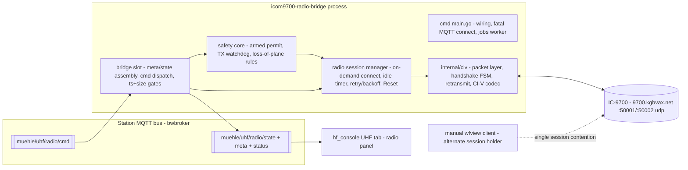
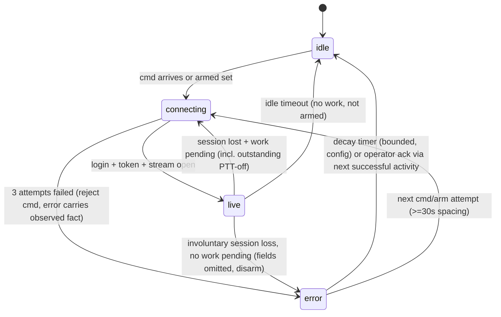

# IC-9700 UHF Radio Bridge - Plan

## Goal Capsule

- **Objective:** Add the Icom IC-9700 as the UHF station radio — a new Go bridge (`icom9700-radio-bridge`) publishing slot `muehle/uhf/radio` on the station bus, plus a console radio panel on the existing UHF tab and the station docs/exposure review the new TX capability requires.
- **Authority hierarchy:** session-settled decisions (labeled KTDs) > this plan > implementer judgment on details the plan leaves open.
- **Stop conditions:** any protocol fact that contradicts a labeled KTD surfaces as a blocker, not a silent adaptation; any safety-bound (arm gate, PTT watchdog, MQTT-loss disarm) found infeasible stops the pipeline.
- **Execution profile:** subagent implementation per unit; CI-V protocol facts come from the protocol brief (committed by U1 as `icom9700-radio-bridge/docs/civ-research-brief.md` and reproduced in this plan's Appendix) — the implementer ports that behavior, it does not re-derive it.
- **Tail ownership:** caller pipeline (LFG) owns commit/push/PR after ce-work returns.

---

## Product Contract

### Summary

The UHF station gains its radio: the IC-9700 at `9700.kgbvax.net`, controlled over CI-V via Icom's RS-BA1-compatible LAN protocol. The bridge is the bus-side owner of the radio's control surface: it reports MAIN/SUB VFO state, meters, and satellite mode; it executes frequency/mode/preamp/power commands; and it offers PTT behind an explicit arm gate. The radio's single LAN session is shared with manual wfview use by connecting only on demand.

### Problem Frame

The UHF station has rotators and polarization on the bus but no radio: every UHF operation needs a human at wfview or the front panel. The IC-9700 is network-attachable and is already declared as `muehle/uhf/radio` in the station integration model (§7.2, deferred in §12). Automation (satellite passes, band changes) and the console need a bus surface for it. The design constraint the user set: the radio must stay freely available for manual wfview operating, so the bridge is a polite on-demand client, not a permanent session holder.

### Requirements

**Connectivity and session**

- R1. The bridge connects to the radio on demand (a pending `/cmd` or an armed state), performs the full RS-BA1 handshake (are-you-there, login with configured credentials, token renewal, CI-V stream open), and disconnects after an idle timeout (default 120 s, config). Radio keepalives and meter frames do not count as work.
- R2. The bridge never auto-steals the session: while disconnected it makes no login attempts except cmd-driven, armed-held, or safety-driven ones (a safety-driven connect exists solely to deliver an outstanding PTT-off — bounded to the same 3 attempts ≥30 s; if it cannot deliver, the terminal fact `ptt-off undeliverable: session unavailable` lands in `/state.error`). A failed connect rejects the triggering cmd into `/state.error` with the observed failure fact; a failed ARM-triggered connect rejects the arm cmd and leaves `armed:false` (the operator re-arms).
- R3. Session loss (radio reboot, network drop, idle timeout, wfview eviction) is a full re-login path: no resume. On involuntary session loss the bridge republishes `/state` with radio-measured fields omitted, resolves in-flight cmds as rejected, disarms, and enters `error` (decaying to `idle` per the state machine); an outstanding PTT-off becomes a safety-driven connect trigger per R2.
- R4. MQTT-plane loss while PTT is on forces immediate PTT-off and disarm (control-plane loss degrades to inaction).

**Bus contract**

- R5. One slot `muehle/uhf/radio` with the four-plane schema; `/state` carries top-level active-TX fields (`freq_hz`, `band`, `mode`, `tx` as the canonical `"tx"|"rx"` string enum, not a bool — flexbridge and the console panels pattern-match the string) plus `main` and `sub` detail objects (band, `freq_hz`, mode, data-mode, preamp/attenuator per band), `selected_vfo`, `satellite` mode, `session_state` (`idle|connecting|live|error`), `device_online`, `armed`, and meter fields (s_meter, tx_power, swr, alc) — the hybrid shape of KTD-3.
- R6. Radio-measured `/state` fields are **omitted** (not zeroed, not frozen) whenever the bridge holds no live session; `ts`, `device_online:false`, `session_state`, `armed`, `error`, and `selected_vfo` (bridge-held state) remain, while `satellite` mirrors radio state and is omitted with the radio-measured fields; the established freshness heartbeat covers the stamped fields. While live, `selected_vfo` and `satellite` are reconciled from the radio once per poll tick (`07 D2 00` read, `16 5A` read) so front-panel and wfview-side changes surface on the bus; between sessions the last bridge-held `selected_vfo` remains published per the per-state rules.
- R7. Bands derive from the canonical table (`2m`, `70cm`, `23cm`); modes normalize to `cw|usb|lsb|am|fm|data` — any mode value outside the canonical set (DV `17`, DD `22`, RTTY `04`/`08`) is never published raw (field omitted), so the transceive path has one defined behavior for every radio mode byte.
- R8. `/meta` declares capabilities and a **read-only** expose block (v1: no PTT/arm widgets in HA), following the sat-rotator expose posture.
- R9. `/cmd` actions: `set_freq`, `set_mode`, `set_data`, `set_preamp`, `set_attenuator`, `set_power` (per-VFO, value-key convention), `sat_mode` toggle, `arm`/`disarm`, `ptt` (`on`/`off` toggles, not hold-to-talk). All one-shot class: ts gate, clear-after-execute-or-reject, size gate, clipped rejections, QoS-0 subscription.
- R10. `ptt` is rejected with a specific `/state.error` unless `armed` is set AND `session_state=live`; `sat_mode` is rejected while `tx` is on or `armed` is set.

**Safety**

- R11. `armed` is a bridge-held permit that drops on any session loss and on bridge restart (fail-disarmed); while armed, the session is held open (armed blocks idle-disconnect).
- R12. A max-TX watchdog (default 180 s, config) force-releases PTT while a session is live or can be re-established: PTT-off, disarm, `/state.error`. While the session is down, the watchdog disarms and errors immediately and reissues PTT-off via the safety-driven reconnect; until the unkey-on-session-loss bench pin (a deploy Go/No-Go gate) proves otherwise, radio self-unkey is the only bound in that state — a keyed carrier with a dead session and a blocked reconnect is a recorded exposure vector, not a 180 s-bounded one.
- R13. The arm gate is software-only (the IC-9700 has no external TX-inhibit path here); this is an accepted posture to be recorded in the exposure review, not hidden.

**Console**

- R14. hf_console gains a UHF radio panel on the existing UHF tab: session-state readout (idle/connecting/live/error), MAIN/SUB freq+mode readout with a selected-VFO marker, meters where present, arm toggle (enabled whenever the bus link is up — arm-while-idle is the connect trigger), and a PTT toggle that is disabled unless armed and live; `/state.error` surfaces via the established ERR-tag pattern, and healthy idle renders neither an OFFLINE tag nor a station fault row.
- R15. `wiring.dart` carries the bus contract entries: `cmdRetain['muehle/uhf/radio'] = false` and an `expectedSlots` entry (a missing cmdRetain key crashes the console).

**Docs and exposure**

- R16. The station docs reflect the new slot: root CLAUDE.md project + slot tables, integration model §7.2/§7.3/Appendix A (the hybrid VFO shape, satellite/preamp/bias-t clarification), and `icom9700-radio-bridge/docs/mqtt-api.md` as the wire contract. §7.2 and the wire contract pin `device_online` for this slot as **CI-V control-session liveness** (healthy idle = `false`; network-standby reachability is not reported), with `session_state` the idle-vs-fault discriminator — the model's generic device-reachability meaning is overridden here on purpose.
- R17. A per-vector exposure review lands in `docs/known-issues.md` before deploy (sat-rotator U9 precedent): remotely-keyable transmitter, software-only gate, PTT-over-lossy-bus, watchdog bounds (and their session-liveness scoping per KTD-5), HA read-only expose posture — plus the inbound HA-bridge `/cmd` path (any house-LAN MQTT client can publish `arm` then `ptt`), bridge-process death while keyed and the alive-but-session-blocked case (keyed, session dead, reconnect refused — no bridge-held bound survives SIGKILL, and the radio's unkey-on-session-loss behavior is the only remaining bound until the bench pin proves it), the accepted no-alerting posture (a watchdog trip surfaces only via console ERR tag / HA sensor — nobody is paged), the CI-V credential vector (login credentials cross the LAN as substitution-table-obfuscated — trivially reversible — UDP payloads on :50001, so a passive capture recovers them; accepted as the protocol's ceiling, bound by 0600 env-file-only storage, the never-log pin, and radio-side password change as the rotation path), the bridge's own MQTT credential hop (first shari-hosted service to reach the broker over a non-loopback plaintext `tcp://` path — a passive capture recovers the broker account password whose publish reach includes `arm` then `ptt`; accepted under the house-LAN trust posture, bound by broker-account scoping with a future `tls://` path), and the standing-armed-permit exposure (armed is the only session-hold primitive; a forgotten arm toggle holds the radio's single session indefinitely).

**Ops**

- R18. Deploy to shari as a hardened systemd unit (seed-once 0600 TOML + env-file password, MemoryMax, NoNewPrivileges set per flexbridge/spid templates); MQTT broker defaults to `tcp://bwbroker:1883` per KTD-7; UDP retransmit buffers and all radio-silence-growable structures are bounded (MemoryMax lesson).

### Scope Boundaries

- **Out of scope (v1):** audio streaming (the bridge never opens the :50003 audio stream; the module layout leaves room for an audio sidecar to add it later — KTD-9), spectrum-scope data, DV/DD mode control, radio LAN main-power on/off (`18 01/00` — never emitted by the bridge; `18 01` standby behavior remains a bench pin for a future unit), split/`0F` control (no bus consumer; satellite duplex is the radio's satellite mode via `sat_mode`), wfview server multiplexing, console UHF page reorganization (the panel joins the existing tab).
- **Bench pins:** probe/login behavior while another client holds the session (and whether the radio refuses or evicts a second client); login lockout timing — pinned at the deploy gate BEFORE retry parameters finalize; LAN power-on standby behavior; `/meta.device` firmware string. UNKEY-ON-SESSION-LOSS is NOT a non-blocking pin — it is deploy Go/No-Go gate 5 (see Deployment / Operational Notes).

---

## Planning Contract

### Key Technical Decisions

- KTD-1. **Native Go RS-BA1 protocol client, no kappanhang/hamlib layer.** CI-V over LAN on the IC-9700 is Icom's RS-BA1-style UDP protocol: control stream `:50001/udp` (are-you-there, login with substitution-table-obfuscated credentials, session token renewed every 60 s, stream request), CI-V data stream `:50002/udp` (raw CI-V frames inside a 16-byte packet header + 0x15-byte sub-header), audio stream `:50003/udp` (unused). Sequence tracking with retransmit requests on both sides; keepalives ~100 ms idle packets, ping every 500 ms; CI-V data watchdog re-opens the stream after 2 s of silence. Port wfview's `icomudp*`/kappanhang behavior — all constants are in the research brief. hamlib+kappanhang was rejected: a second daemon, and hamlib's 9700 satellite handling (MAIN/SUB swapping under gpredict) is its weakest area.
- KTD-2. **On-demand session model** (session-settled: user-directed — chosen over bridge-owns-exclusive and wfview-server-hub: keeps the radio free for manual wfview operating). Consequences adopted with it: never steal the session; telemetry only flows while a session is live; `device_online:false` is a healthy idle state, distinguished from fault only by `session_state` (R5/R6).
- KTD-3. **One slot, hybrid state shape** (session-settled: user-directed — main+sub VFO objects chosen over two slots and over active-VFO-only: one device is one slot and duplex truth stays in one snapshot). Deviation from the model's flat active-TX rule is mitigated, not removed: top-level flat active-TX fields are ADDED alongside `main`/`sub` (R5), and §7.2 is updated to pin the hybrid shape.
- KTD-4. **PTT behind a software arm gate** (session-settled: user-directed — chosen over no-remote-PTT and ungated PTT: automations may key the radio, but only after an explicit operator permit). The gate is bridge-held, drops on session loss and restart (R11); it is not a radio-wide TX inhibit — a human at the radio can always key the mic regardless of bus `armed`.
- KTD-5. **Safety bounds** (planning decision from flow analysis, scoped honestly by review): the TX watchdog (180 s default) bounds only the LIVE-session stuck-keyed case — its force-release is a PTT-off frame that needs a session. While disconnected, the bounds are the safety-driven PTT-off reconnect (R2) plus the radio's own unkey-on-session-loss behavior, which is unverified until the bench pin lands and is therefore a **Go/No-Go deploy gate**, not a non-blocking pin: a failed unkey pin trips the Goal Capsule stop condition for remote PTT (control-only deploy). MQTT loss → PTT-off + disarm; armed holds the session open; involuntary session loss → disarm immediately, PTT-off reissued via the safety-driven reconnect.
- KTD-6. **One-shot /cmd class** (planning decision; flow analysis flagged the retention trap): `cmdRetain['muehle/uhf/radio'] = false`. A retained arm permit would re-arm after every bridge restart, defeating the settled fail-disarm.
- KTD-7. **Broker via `bwbroker` DNS indirection** (session-settled: user-directed — chosen over hardcoding either broker address (.50, the HA-side host this session repointed pol-ctrl to, or .140, the Pi's current address — the repo docs still carry the migration's stale .139): the user maintains the DNS entry to point at whichever broker is active for bauwagen business). Config default `tcp://bwbroker:1883`; a mqtt-topology.md note records the convention. Constraint (conflict call-out from deepening): `bwbroker` may resolve only to the `muehle/#`-authoritative broker — replication is split-direction (state/meta/status shack->HA, `/cmd` HA->shack only), so a target on the HA consumer broker strands the slot from shari-local consumers and deafens it to console cmds; the deploy gate verifies resolution before seeding config. This is also the first shari-hosted service to deviate from the topology doc's loopback addressing rule — the addressing-table row gets annotated, not just a convention line.
- KTD-8. **Meter cadence ≤1 Hz into the retained `/state`** (planning decision): S-meter/SWR/ALC/tx-power read once per poll tick with dedup; a non-retained meter sub-topic stays available if §12's fast-meter concern re-appears.
- KTD-9. **Audio sidecar headroom** (session-settled: user-approved — control-only v1 with the stream abstraction left open): the `internal/civ` package exposes the stream concept (control + civ data today) so a sidecar can add the audio stream without protocol rework.
- KTD-10. **CI-V semantics pinned from research:** radio CI-V address `A2`, controller `E0`; MAIN/SUB via `07 D0`/`07 D1` (+`07 D2` read), satellite mode `16 5A`, PTT `1C 00`, ID probe `19`, RF output power `14 0A` (0-255, applies to the currently selected band's VFO — select the VFO via `07 D0`/`07 D1` before setting; main-power on/off `18 01/00` is the OUT-OF-SCOPE LAN power command and is never emitted by the bridge), S-meter `15 02`, SWR/ALC/comp `15 12/13/14`, preamp `16 02`, attenuator `16 11`, freq/mode `05`/`06` with 10-digit BCD little-endian and 2-byte mode+filter; `NG` (`FA`) replies are rejections; parse CI-V frames by the UDP sub-header `datalen`, never by scanning for `FD` (scope/keyer payloads can embed it). All constants live in the protocol brief (see Sources); a U3 test asserts `set_power` never emits an `18 0x` frame.

### High-Level Technical Design

Session state machine (the `/state.session_state` value drives every consumer):

`/state` per state: `live` -> all fields; `idle`/`connecting`/`error` -> `ts`, `device_online:false`, `session_state`, `armed` (false unless mid-drop), `error` (observed facts only, e.g. `login refused`), `selected_vfo` (bridge-held), radio-measured fields omitted. Safety-class `error` facts (watchdog trip, `ptt-off undeliverable`) do not decay: they persist in `/state.error` until operator ack (next arm/cmd activity) while only `session_state` decays `error`->`idle` — the R17 "never dismiss" posture.

### Assumptions and Bench Pins

- The handshake/keepalive/retransmit parameters (wfview-derived) work against the user's firmware (latest v1.50, 2025-08; protocol unchanged since v1.30) — verify at bench with a protocol log.
- Availability probing while another client holds the session is unverified; v1 ships the coarse story (`error` carries only observed facts) and the bench pins whether a distinguishable `radio_busy` signal is possible.
- The radio's unkey-on-session-loss behavior is unverified; KTD-5's watchdog does not depend on it.
- Radio in full power-off (not network standby) is unreachable by design; no LAN wake in v1.

### Sources

- The protocol brief is committed with this plan as the Appendix below, and U1 lands it as `icom9700-radio-bridge/docs/civ-research-brief.md` so executing subagents have the constants without re-deriving them. Provenance: wfview `icomudp*`/`packettypes.h`/`CI-V.md` (gitlab.com/eliggett/wfview), kappanhang (github.com/nonoo/kappanhang), official IC-9700 CI-V Reference Guide, Icom firmware notes (v1.50 2025-08-21), gpredict #181/#287 (hamlib satellite weakness).
- Repo: `flexbridge/` (slot skeleton, Reset/StateHeartbeat, seed-once deploy), `spid-ercm-rotator-bridge/internal/mqttslot/` (ts gate, size gate, clear-after-execute, freshness heartbeat — the newest template), `ultrabridge/internal/mqtt/client.go` (fatal-connect, QoS-0 sub rationale), `docs/station-integration-model.md` §7.2/§7.3/§8/Appendix A, `docs/conventions/band-mode-reference.md`, `hf_console/lib/store/wiring.dart`.

---

## Implementation Units

### U1. Module scaffold and deployment shell

- **Goal:** `icom9700-radio-bridge` exists as a workspace module that builds, deploys, and follows the station skeleton — config with `bwbroker` default, hardened unit, seed-once deploy.
- **Requirements:** R18; KTD-7.
- **Dependencies:** none.
- **Files:** `icom9700-radio-bridge/cmd/icom9700-radio-bridge/main.go`, `internal/config/config.go`, `internal/config/config_test.go`, `config.example.toml`, `deploy.sh`, `Makefile`, `CLAUDE.md`, `docs/civ-research-brief.md` (the protocol brief, committed from this plan's Appendix), `go.work` (add module).
- **Approach:** lift the flexbridge main.go wiring (publisher-before-connect, bounded jobs channel, LWT, OnConnect re-subscribe) and its deploy.sh (seed-once 0600 TOML + env file, arm64 build, NoNewPrivileges/ProtectSystem/RestrictAddressFamilies, add `MemoryMax=256M` per the newer spid/hf templates). Logging per docs/conventions/logging.md from the first commit: slog text handler, constant `component: icom9700-radio-bridge` attr, per-slot child logger. Config: `radio_host` (default `9700.kgbvax.net`), `[mqtt] broker = "tcp://bwbroker:1883"`, `[civ] username/password via env (`ICOM9700_CIV_PASSWORD`), `[session] idle_timeout=120s, tx_watchdog=180s, max_attempts=3, attempt_spacing=30s, error_decay=60s` (the state machine's error→idle timer; extends the committed U1 config.go/config.example.toml), `[radio] poll_interval`, site/station/slot=`muehle/uhf/radio`. Fatal exit on initial MQTT connect failure (§8.1-10).
- **Patterns to follow:** `flexbridge/cmd/flexbridge/main.go`, `flexbridge/deploy.sh`, `spid-ercm-rotator-bridge/deploy.sh` (MemoryMax), ultrabridge fatal-connect.
- **Test scenarios:** config parses example TOML to expected values; env override `ICOM9700_CIV_PASSWORD` reaches the civ credentials; explicitly-missing `-config` is fatal, absent default yields defaults (ultrabridge convention); deploy.sh `bash -n` passes.
- **Verification:** module builds under `go build ./...` (workspace), unit compiles cross-target `GOOS=linux GOARCH=arm64`.

### U2. internal/civ: RS-BA1 UDP transport layer

- **Goal:** a tested Go implementation of the Icom LAN protocol transport: 16-byte packet header layer, handshake FSM (are-you-there → ready-IDs → login → token → stream request → CI-V stream open), sequence tracking with single+bulk retransmit, keepalive/idle packets, 500 ms ping, 60 s token renewal, CI-V-data watchdog (2 s silence → re-open), clean disconnect.
- **Requirements:** R1, R3; KTD-1, KTD-9.
- **Dependencies:** U1.
- **Files:** `icom9700-radio-bridge/internal/civ/packet.go`, `handshake.go`, `stream.go`, `token.go`, `transport.go`, plus `transport_test.go`, `handshake_test.go`, `fakeradio_test.go`.
- **Approach:** port the wfview `icomudpbase`/`icomudphandler`/`icomudpcivdata` behavior per the protocol brief (constants: packet types, header offsets, radio-side ports from the status packet at 0x42/0x46 big-endian, substitution-table credential obfuscation). Credential-bearing packets (login, token, renewal) are never logged at any level, and the bench protocol-log procedure redacts the login exchange before diffing against wfview — the substitution table is public, so captured bytes ARE the password. Bound every buffer (retransmit window, sequence map, pending-queue — MemoryMax lesson). Stream abstraction: `control` and `civ` streams now; a future `audio` stream plugs into the same open/close machinery (KTD-9). The fake radio is an in-process UDP server speaking the same packet grammar, scripted per test.
- **Patterns to follow:** `spid-ercm-rotator-bridge/internal/spid` (scripted fake-port tests, watchdog shape), flexbridge `internal/flexradio/client.go` (dial/run-loop shape).
- **Test scenarios:** happy handshake against the fake radio reaches `live` (assert the exact packet sequence); radio silent during are-you-there → connect attempt times out at the configured bound; packet loss (drop N datagrams in the fake) → retransmit requests recover, no duplicate CI-V frames emitted; token renewal fires within the window while live; 2 s CI-V silence triggers the watchdog re-open; radio stops answering keepalives → session-loss callback fires; concurrent cmds serialize; buffers stay bounded under a fake radio flood (no unbounded growth); credential-derived bytes (username/password, pre- and post-substitution-table) never appear in captured slog output at any level across a full handshake incl. login and token renewal (mechanizes the R17 never-log pin).
- **Verification:** `go test -race ./internal/civ/` green with the scripted-radio suite.

### U3. internal/civ: CI-V codec and command layer

- **Goal:** frame build/parse for the command table: freq (10-digit BCD LE), mode+filter, data mode, main/sub select, satellite mode, PTT, RF output power, ID, S-meter/SWR/ALC/comp, preamp/attenuator, transceive broadcasts (freq/mode/tx changes), with NG-rejection surfacing and datalen-based framing.
- **Requirements:** R7, R9, R10; KTD-10.
- **Dependencies:** U2.
- **Files:** `icom9700-radio-bridge/internal/civ/civ.go`, `codec.go`, `commands.go`, `transceive.go`, plus `civ_test.go`, `codec_test.go`.
- **Approach:** byte-pinned tables per the research brief (`A2`/`E0` addresses, mode byte map: `00`→lsb, `01`→usb, `02`→am, `03`→cw, `05`→fm, `07`→cw (report as `cw`), data-mode modifier `06 <00/01> <filter>`; band vocabulary `2m/70cm/23cm` with per-VFO range validation — SUB has no 23cm). Parse strictly: reply dispatcher on command bytes; `FA` (NG) becomes a typed rejection error carrying the command; malformed/garbage frames are counted and dropped, never panic. Band-plan validation lives here (reject out-of-range freq per VFO).
- **Test scenarios:** BCD encode/decode round-trip for 144.500.000 / 432.100.000 / 1296.100.000; mode byte → canonical mode for every supported mode; data-mode on/off frames match the table byte-for-byte; RF output power frames carry `14 0A` (and nothing in the codec emits `18 0x`); NG reply → typed rejection; transceive broadcast parse extracts band/freq/mode/tx; DV/DD mode bytes are recognized but reported as unsupported (omitted, never raw); a frame containing an embedded `FD`-like byte inside payload data parses by datalen; SUB-VFO 23cm set → rejection.
- **Verification:** codec table tests green under `-race`; every command-table entry exercised against the fake radio through the U2 transport at least once.

### U4. Radio session manager

- **Goal:** the on-demand lifecycle above the transport: work-driven connect, idle timeout (keepalives/meters are not work), armed-holds-open, retry with spacing, session-loss handling (republish-omitted state, reject in-flight cmds, PTT-off-on-reconnect + disarm), full re-login on every reconnect.
- **Requirements:** R1, R2, R3, R11; KTD-2, KTD-5.
- **Dependencies:** U2, U3.
- **Files:** `icom9700-radio-bridge/internal/radio/session.go`, `session_test.go`, `manager.go`.
- **Approach:** state machine per HTD; work definition = pending cmd or armed permit (never keepalives/telemetry); retry policy 3 attempts ≥30 s apart, then error state carrying the observed failure; session loss → `Reset()` semantics (flexbridge precedent: omit radio fields, publish once so change-gating cannot freeze stale telemetry); reconnect is always a fresh handshake (token/session invalid after radio reboot).
- **Patterns to follow:** flexbridge `radioLoop` backoff + `Reset()`, spid markDown/reopen, mqttslot state machine tests.
- **Test scenarios:** cmd during `idle` drives idle→connecting→live→execute→(idle timer)→disconnect; armed set during `idle` connects and holds; arm during radio-off → 3 spaced attempts → error state, arm cmd rejected, `armed:false` republished, no further login attempts until the next cmd/arm; disarm with no traffic starts the idle timer; fake radio refuses login 3x → error state + cmd rejected with observed reason + ≥30 s spacing asserted between attempts; radio reboots mid-session (fake drops and restarts with new radio ID) → full re-login succeeds, PTT-off sent first if PTT was on (safety-driven trigger), armed cleared, state republished with fields omitted; involuntary session loss with no work pending → error state (decaying to idle per the timer), fields-omitted republish; session loss resolves an in-flight cmd as rejected, not silently dropped; wfview-holds simulation (radio refuses login immediately) → no retry storm (spacing holds), error text is the observed fact.
- **Verification:** session state-machine tests green under `-race`; no login attempt storm under contention simulation.

### U5. Bridge slot surface

- **Goal:** the four-plane MQTT surface: `/meta` (read-only expose), `/state` hybrid shape with per-state payload rules and ≤1 Hz meters, `/cmd` dispatch for the full settled action set with the established gates.
- **Requirements:** R5–R10, R8, R9; KTD-3, KTD-6, KTD-8.
- **Dependencies:** U1 (module, config), U4 (session manager).
- **Files:** `icom9700-radio-bridge/internal/bridge/bridge.go`, `state.go`, `cmd.go`, `publish.go`, `bridge_test.go`, `cmd_test.go`, plus `icom9700-radio-bridge/docs/mqtt-api.md`.
- **Approach:** lift the spid-ercm mqttslot machinery (ts gate with unstamped tolerance, 4 KB size gate, clear-after-execute-or-reject with echo guard, 200-rune rejection clip, freshness heartbeat on stamped fields, paho handler Enqueue-only). State assembly: top-level active-TX fields mirror the TX VFO — **SUB in satellite mode** (SUB is the uplink/TX side, MAIN the downlink; the inversion gpredict #181 documents), MAIN otherwise; `tx` is the string enum `"tx"|"rx"`; meters polled once per poll tick while live, plus `07 D2 00` selected-VFO and `16 5A` satellite-mode reads on the same tick (R6 radio-truth reconciliation — front-panel/wfview changes must surface), dedup-suppressed (KTD-8); `/state.error` taxonomy: `ptt rejected: not armed`, `ptt rejected: session not live`, `freq rejected: out of band for sub`, `radio: login refused`, `ptt-off undeliverable: session unavailable` (observed facts only). `/meta` capabilities follow the model's Appendix-A structured object (a flat action list is a shape nothing consumes): `bands: [2m, 70cm, 23cm]`, `modes: [cw, usb, lsb, am, fm, data]`, `bias_t: true` (informational — bias-t is set via the radio menu per deploy gate 3; no bus action in v1), `satellite: true`, `vfos: [main, sub]`; the expose mode enum uses `options_ref: "modes"`. Expose is read-only (freq number + mode enum as measurement/sensor fields, `tx` declared as `type: boolean, on: "tx", off: "rx"` per the flexbridge shape), following the rotator posture — HA renders no PTT/arm widgets in v1; the action set lives in `docs/mqtt-api.md` (an expose `actions[]` is additive later without breaking anything, and the `armed ∧ live` precondition is derivable from `/state` so future trackers are not blocked).
- **Patterns to follow:** `spid-ercm-rotator-bridge/internal/mqttslot/slot.go` (the newest, most complete gate template), flexbridge `bridge.go` state assembly, model Appendix A radio example.
- **Test scenarios:** full happy path over the fake radio through the real slot: set_freq main → `/state.freq_hz` updates via transceive or poll; per-state payload rules: disconnect → radio fields omitted, stamped fields fresh; ptt while unarmed → rejected with exact error string, radio PTT frame never sent; ptt while armed+live → `1C 00 01` on the wire, `tx:"tx"` in state; ptt off clears; sat_mode while tx → rejected; sat_mode toggle sets radio satellite mode and state reflects it; set_freq on SUB to 1296 MHz → band rejection; DV mode set → rejected as unsupported mode; oversized payload → fixed-string rejection, no echo; stale ts → dropped; unknown action → warn + drop; set_freq on MAIN in satellite mode → top-level fields mirror SUB (uplink) not MAIN; meter fields appear while live at ≤1 Hz and dedup-suppress while unchanged; retained `/meta` never clobbered before first successful radio identity read (flexbridge handshake lesson); a radio-initiated selected-VFO or satellite change (front-panel/wfview simulation) is picked up by the next poll tick, flipping `selected_vfo`, the SEL-marker source, and the top-level mirror (R6 reconciliation).
- **Verification:** slot tests green under `-race`; mqtt-api.md tables match the implemented actions field-for-field.

### U6. Safety core: arm gate, PTT watchdog, loss-of-plane rules

- **Goal:** the TX safety machinery as a separately tested unit: armed permit lifecycle, max-TX watchdog, MQTT-loss disarm, session-loss PTT resolution.
- **Requirements:** R4, R10, R11, R12, R13; KTD-4, KTD-5.
- **Dependencies:** U4, U5 (integrates with both; build after their interfaces exist).
- **Files:** `icom9700-radio-bridge/internal/bridge/safety.go`, `safety_test.go`.
- **Approach:** armed is bridge-local state, `false` on boot, cleared by `disarm`, session loss, watchdog expiry, and MQTT-plane loss; PTT dispatch requires `armed ∧ session_state=live` at send time; watchdog is a rearmable timer per PTT-on (default 180 s from config); watchdog-trip and `ptt-off undeliverable` are safety-class `/state.error` facts — they persist until operator ack (next arm/cmd) instead of decaying, while only `session_state` decays error→idle (R17 posture); MQTT connection-lost callback → immediate PTT-off attempt + disarm + `/state.error` on reconnect; session loss mid-PTT → reissue PTT-off with priority on reconnect, disarm regardless (the radio-side unkey behavior is the bench-pin; the watchdog is the independent bound).
- **Patterns to follow:** m5stamp-hf-ctrl's derived armed formula (permit ∧ link) adapted to bus semantics; spid executeStop's fault-surfacing.
- **Test scenarios:** arm → live → ptt on → watchdog fires at bound → PTT-off frame sent, disarmed, error published, all three logged at **Warn** with the slot attr (fake radio asserts frame order; journalctl -p warning is the station's only error filter); watchdog expiry WITHOUT a live session → immediate disarm + error, PTT-off reissued on the safety-driven reconnect (asserts the session-scoped watchdog contract); ptt on → fake MQTT connection-loss hook → PTT-off + disarm within the bound, no further cmds accepted until rearmed; session drop mid-PTT → disarm immediate, PTT-off reissued via the safety-driven reconnect; arm → session drop → armed:false republished; disarm during live PTT → PTT-off sent; restart (new bridge process on the same bus) → armed:false, ptt rejected; every rejection produces the specific error string and never a raw radio frame; the watchdog-trip error persists across the session_state error→idle decay until the next arm/cmd ack.
- **Verification:** safety tests green under `-race`; a full arm→ptt→loss→recover scenario asserted end-to-end through the fake radio.

### U7. Console radio panel

- **Goal:** the UHF radio panel on hf_console's UHF tab plus the bus contract entries.
- **Requirements:** R14, R15.
- **Dependencies:** U5 (state shape must exist; panel development runs against fixtures).
- **Files:** `hf_console/lib/ui/widgets/uhf_radio_panel.dart`, `hf_console/lib/store/wiring.dart` (cmdRetain + expectedSlots + payload builders), `hf_console/lib/store/bus_store.dart` (session-slot liveness carve-out: slots whose `/state` carries `session_state` key `isOnline`/offline-listing on `/status`, not `device_online` — R16 pins `device_online:false` as healthy idle here), `hf_console/lib/ui/screens/console_screen.dart` (UHF tab column), `hf_console/test/ui/widgets/uhf_radio_panel_test.dart`, `hf_console/test/support/fixtures.dart` (`setUhfRadio` fixture), `hf_console/CLAUDE.md` (retained-cmd list note: uhf/radio non-retained).
- **Approach:** follow the pol-ctrl panel contract exactly, with deliberate deviations for the on-demand model. Panel control set for v1: per-VFO frequency entry (text field + steppers, the sat-rotator pattern) and a mode button row (the pol-ctrl pattern) beside each VFO readout, publishing `set_freq`/`set_mode` with the payload naming the targeted VFO per R9's per-VFO value-key convention; plus `arm`/`disarm` and `ptt` toggles. `sat_mode`, `set_preamp`, `set_attenuator`, `set_data`, `set_power` are out-of-panel for v1 (bus actions remain per mqtt-api.md); satellite mode renders as a SAT tag on the readouts from `/state.satellite`. The readout always renders (idle/connecting/live/error is the panel's core value); the ARM/DISARM toggle is enabled whenever the bus link is up AND the slot's `/status` is live, regardless of session state — arm-while-idle is the bridge's connect trigger (R1), so gating it on live, or on `slot.isOnline` (which folds in `device_online`, false at healthy idle per R16), would make the loop unreachable from the panel; PTT and tuning actions gate on `armed ∧ session_state=live`. Liveness rendering keys on `/status`, not the retained `/state`: a dead bridge leaves a retained idle snapshot, so the OFFLINE tag renders whenever `/status` is offline regardless of `session_state`, and the session-state tag renders only while `/status` is live — healthy idle with `/status` up is not a fault (R16). The arm tap carries the same pending semantics as PTT: set on tap, cleared by the first `/state` newer than the tap (`armed` flip = success, `/state.error` = ERR tag), with a 5 s local timeout reverting to a "no bus confirmation" ERR tag. PTT is a toggle whose pending state is: set on tap, cleared by the first `/state` newer than the tap (`tx` flip = success, `/state.error` = ERR tag), with the same 5 s local timeout ERR. Readout from `/state` readback only, never tap optimism; `tx` read as the `"tx"|"rx"` string (the antenna/dvk panel pattern, not a bool); ERR tag + text from `/state.error` (established pattern). A selected-VFO marker (SEL tag from `/state.selected_vfo`) renders on the MAIN/SUB readouts so the operator knows which VFO a `set_freq` hits and which one PTT keys. Safe accessors throughout (stateValueAs/is-num guards — the sat-panel lesson). Fixture seeds the full state shape incl. meters, the string `tx` enum, `device_online:false` on the idle variant, and a connecting-state variant at real RFC3339 ts.
- **Patterns to follow:** `hf_console/lib/ui/widgets/pol_ctrl_panel.dart`, `sat_rotator_panel.dart` (safe accessors, ERR pattern), wiring.dart radio section.
- **Test scenarios:** fixture renders freq/mode/meters for both VFOs; idle state renders the session readout with PTT and tuning actions disabled and the arm/disarm toggle ENABLED; connecting state renders an amber CONNECTING tag with actions gated; armed+live enables PTT; unarmed PTT tap is impossible (button disabled) and the rejection path still renders ERR when it arrives from the bus; PTT pending state clears on the next `/state` and times out to an ERR tag at 5 s; selected-VFO marker tracks `selected_vfo` for both values; type-confused /state renders dashes, never throws; arm toggle publishes the correct payload via the cmdRetain map (no crash — the missing-key case is covered by the contract entry); error-free republish clears ERR; healthy-idle state (`device_online:false`, `/status` up) produces no OFFLINE tag, no station fault row, and an ENABLED arm toggle; `/status` offline over a retained idle `/state` renders OFFLINE with actions disabled; a dead-bridge arm tap times out to the no-confirmation ERR at 5 s.
- **Verification:** `flutter analyze` clean; `flutter test` green including the new panel group.

### U8. Station docs and exposure review

- **Goal:** the bus-facing documentation and the deploy-gating exposure review for a remotely-keyable transmitter.
- **Requirements:** R16, R17.
- **Dependencies:** U5 (the implemented shape is what gets documented).
- **Files:** `CLAUDE.md` (project table row, slot table row after `muehle/uhf/pol-ctrl`), `docs/station-integration-model.md` (§7.2 full entry: hybrid VFO shape, satellite/preamp/bias-t clarification, on-demand session; §7.3 adapter table; Appendix A example refresh), `docs/known-issues.md` (exposure review block carrying R17's FULL vector list: remotely-keyable transmitter + software-only gate, PTT over lossy bus + session-scoped watchdog bounds, the inbound HA-bridge `/cmd` path, bridge-process death while keyed AND the alive-but-session-blocked case, the accepted no-alerting posture, the CI-V credential-sniffing vector + never-log pin, the standing-armed-permit exposure, single-session contention policy, HA read-only expose posture, bwbroker DNS indirection), `docs/conventions/mqtt-topology.md` (bwbroker convention line + shari addressing-table row annotation per KTD-7), `docs/conventions/band-mode-reference.md` (replace the stale "23 cm is currently out of scope for automation" note — this plan automates 23cm on the IC-9700), `shelly-power-bridge/docs/known-issues.md` (update the `uhf/radio` mystery-feed note — the slot now has an owner).
- **Approach:** follow the sat-ops U9 documentation unit's shape exactly; the exposure review is per-vector `[decision]` entries in the established register format, under a block header naming this plan file, citing THIS plan's KTD numbers for the corresponding vectors (the register has no KTD series of its own — plan-scoped citations are the established pattern). Three doc notes the deepening pass requires: (1) §7.2 pins the slot's `device_online` = CI-V-session liveness with healthy-idle `false` (R16); (2) a one-sentence guard near the model §8 retained-steady-state exception — whose canonical example is literally "an arm permit" — stating the `uhf/radio` arm permit is deliberately NOT that case (re-applying it after restart is the hazard; fail-disarm is R11), so the retained exception must never be applied to it; (3) the topology addressing-table row for shari services is annotated with this service's bwbroker exception (KTD-7), not just a convention line.
- **Patterns to follow:** `docs/known-issues.md` KTD4 exposure-review block (sat-ops), spid-ercm-rotator-bridge docs set.
- **Test scenarios:** cross-reference check — every doc that names `muehle/uhf/radio` agrees with §7.2; no dangling references to the pre-bridge "declared but deferred" status.
- **Verification:** grep passes; the exposure review block exists and names every vector the safety core implements.

---

## Deployment / Operational Notes

Go/No-Go gates, in order (the bench bring-up and deploy run after the pipeline ships the code; the full checklist lives in the deepening run record — these are the load-bearing gates):

1. **Exposure review landed** in `docs/known-issues.md` before any deploy step (R17).
2. **bwbroker resolution check on shari** — `getent hosts bwbroker`; No-Go if it resolves to the HA consumer broker (split-direction replication, KTD-7), and the bridge's MQTT account must exist on whichever broker it resolves to. Also verify `9700.kgbvax.net` resolves to an RFC1918 address from shari and radio UDP :50001–:50003 are not reachable off-LAN (no router port-forward) — the reversible-obfuscation credential vector must stay LAN-scoped.
3. **Radio-side prerequisites:** `[SET] → Network`: Remote Control ON (enabling restarts the radio — expect it), username/password matching the bridge's `[civ]` config, Remote IP left at `0.0.0.0`; `[SET] → Connectors → CI-V`: address `A2`, CI-V Transceive ON (without it, `/state` updates only by poll); verify the per-band bias-t menu setting matches the masthead-LNA wiring (a misconfigured radio keys into a powered LNA with no bus-visible signal).
4. **Deploy order:** console-with-contract-entries may precede the bridge (idle panel renders harmlessly); the only forbidden combination is console-without-entries while the bridge is live (cmdRetain missing-key crash). The bridge deploys last.
5. **UNKEY-ON-SESSION-LOSS IS A GO/NO-GO GATE, not a non-blocking pin:** with a dummy load, key PTT via the bridge, then kill the session path — if the radio does not unkey itself, remote PTT does not ship (Goal Capsule stop condition; control-only deploy). Run before arm is used for real operations. The login-lockout-timing pin also lands here, BEFORE the retry-policy parameters are finalized (3 attempts ≥30 s assumes no radio-side lockout).
6. **First bring-up:** temporarily set `tx_watchdog = 20s`, dummy load on, prove the bound end-to-end (arm → ptt → watchdog fires → PTT-off + disarm), then restore 180 s and confirm `armed:false` after restart (fail-disarmed, R11).
7. **wfview coexistence test (branch on the probe-pin outcome):** if the radio evicts a held session: arm+live → take the radio with wfview → bridge yields (fields omitted, armed:false, no login storm — attempts spaced ≥30 s) → release → cmd reconnects with a full re-login. If the radio refuses a second login (the appendix's stated behavior): disarm via bus → bridge releases within the idle timeout (disarm starts the idle timer, U4) → wfview takes the radio → release → cmd reconnects with a full re-login.
8. **journalctl signatures:** repeated `login refused` with no wfview running = credentials mismatch, lockout, or a stale session left by a previous bridge crash (SIGKILL skips the clean disconnect — wait out the radio's session reaper or power-cycle the radio); repeated handshake timeout = radio off/network; watchdog expiry = a real safety event, never dismiss; `mqtt connection lost` = bwbroker moved.
9. **Rollback precondition — never stop the service while keyed:** confirm `tx:"rx"`, `armed:false` on retained `/state` first; a stopped bridge sends no PTT-off (the unkey-on-loss gate above decides what that means for the carrier).

---

## Verification Contract

| Gate | Command / check | Applies to |
|---|---|---|
| Bridge unit tests | `cd icom9700-radio-bridge && go test -race ./... -count=1` | U1–U6 |
| Vet + format | `go vet ./... && gofmt -s -l .` (empty) | bridge module |
| Cross-target build | `GOOS=linux GOARCH=arm64 go build ./...` | shari deployability |
| Workspace health | root `go build ./...` unaffected by the new module | all |
| Console | `cd hf_console && flutter analyze && flutter test` | U7 |
| Docs | cross-reference grep (U8 verification) | U8 |
| Deploy Go/No-Go gates | exposure review landed (gate 1); bwbroker resolution + LAN scoping (gate 2); unkey-on-session-loss + login-lockout timing BEFORE retry parameters finalize (gate 5) | R17, KTD-5, KTD-7 |
| Bench pins (post-deploy, non-blocking) | protocol log vs brief; probe-while-held; `18 01` standby; firmware string in `/meta.device` | KTD-5 assumptions |

No `release:validate` applies (no release tooling in this repo). Behavioral skill evaluation: none.

---

## Definition of Done

- Global: all units complete; bridge + console gates green; docs land in the same branch; no dead-end/experimental code remains in the diff; the exposure review block is present in `docs/known-issues.md` before any deploy step.
- U1: deploy.sh would seed a working 0600 config on a fresh shari (bwbroker broker, env-file password).
- U2/U3: the fake-radio suite pins the protocol behavior the brief specifies — a wfview log can be diffed against the handshake sequence at bench.
- U4: no login storm under wfview contention; telemetry freezes are impossible (omitted-field republish proven by test).
- U5: every settled cmd action and every rejection path has a test that asserts the exact wire frame or error string, including: `set_power` emits `14 0A` and never an `18 0x` frame; satellite-mode state assembly mirrors SUB (uplink) in the top-level active-TX fields while `tx:"tx"`.
- U7: the panel renders every `/state` shape the bridge can publish (live, idle, connecting, error) without throwing.
- U6: watchdog expiry, MQTT loss, and session loss each end with PTT-off-attempted and disarmed; restart ends disarmed (fail-disarmed, R11 — a fresh process has no outstanding PTT-off to deliver) — all asserted by test.
- U8: a reader of `docs/station-integration-model.md` §7.2 can derive the slot's wire contract without reading the Go code.

---

## Appendix: CI-V over LAN protocol brief

Committed reference for U2/U3 (provenance: wfview source — `icomudpbase/icomudphandler/icomudpcivdata`, `packettypes.h`, `CI-V.md`, `rigs/IC-9700.rig`; kappanhang; official IC-9700 CI-V Reference Guide; firmware v1.50 2025-08-21, protocol unchanged since v1.30). U1 copies this appendix into `icom9700-radio-bridge/docs/civ-research-brief.md`.

**Ports and streams (all UDP):**

| Port | Direction | Purpose |
|---|---|---|
| 50001 | client -> radio (replies to client source port) | Control: are-you-there handshake, login/token auth, stream request; radio assigns data ports |
| 50002 | client <-> radio | CI-V data stream (all `FE FE...FD` frames incl. transceive broadcasts) |
| 50003 | radio -> client | Audio only — UNUSED by this bridge (v1) |

No broadcast/discovery exists; the client must know the radio address. `60000` is a Kenwood preset, not Icom.

**Connection sequence:** (1) send are-you-there (16-byte control packet, type 0x03) to radio:50001 every 500 ms until "I am here" (0x04); (2) exchange are-you-ready/I-am-ready (type 0x06) — establishes 4-byte IDs (`sentid` derived from client IP+port, `rcvdid` from radio) and sequence tracking; (3) login packet (~0x80 bytes): username+password obfuscated by a fixed 1-byte substitution table (public in wfview source — treat as plaintext-equivalent), client name; radio answers with a session token; (4) token renewal (0x40-byte packet, type 0x02) every 60 s; (5) request-stream packet carrying the client's chosen local CI-V port; radio answers with a status packet (~0x50 bytes) containing the radio-side CI-V port (normally 50002) big-endian at offset 0x42 (audio port at 0x46 — unused); error 0xffffffff = connection refused (stale/other session); (6) open a second UDP socket from the chosen local port to radio:50002 and send the open packet (0x16-byte openclose, data 0x01c0, magic 0x04).

**Packet layer (all streams):** 16-byte header (len, type, seq, sentid, rcvdid) + payload; CI-V payloads carry a 0x15-byte sub-header (reply=0xc1, datalen, big-endian send-seq) then raw CI-V. Both sides track sequence numbers and request retransmission of gaps (single- and multi-packet retransmit requests, 100 ms timer, give up after 4 tries, flush if >50 missing). Keepalives: idle control packets every 100 ms; ping (21-byte, type 0x07, radio-uptime ms) every 500 ms. CI-V watchdog: no CI-V data for 2 s -> re-send the start-data packet. Disconnect: control packet type 0x05. Parse CI-V frames by the sub-header `datalen` field, never by scanning for `FD` (payloads can embed it).

**CI-V layer:** address `A2` (radio), `E0` (controller); framing `FE FE A2 E0 <cmd> [] [<data>] FD`; OK reply `...FB FD`, NG `...FA FD` (rejection — e.g. freq/mode sets in satellite or memory mode). Frequency = 10 BCD digits little-endian, 10 Hz -> 100 MHz digit (144.500.000 -> `00 00 50 41 01`). Mode = 2 bytes (mode + filter): `00` LSB, `01` USB, `02` AM, `03` CW, `04` RTTY, `05` FM, `07` CW-R (normalizes to `cw` on the bus — reverse-filter bit is not representable), `08` RTTY-R, `17` DV (unsupported on the bus), `22` DD (unsupported); data mode = `06 <00/01> <filter>` modifier.

**Command table (this bridge's set):** read freq `03`; set freq `05 <10 BCD>`; freq transceive broadcast `00` (radio -> controller, MAIN and SUB changes); read mode `04`; set mode+filter `06 <mode> <filter>`; mode transceive `01`; data mode `06 <00/01> <filter>`; select main band `07 D0` / sub band `07 D1` (read selected: `07 D2 00`); satellite mode on/off/read `16 5A 00/01` (no data = read); PTT on/off + transceive `1C 00 00/01`; transceiver ID `19` (liveness/identity probe); S-meter `15 02` (0-255; S9=120); SWR/ALC/comp `15 12/13/14`; preamp `16 02`; attenuator `16 11`; RF output power `14 0A` (0-255, applies to the currently selected band's VFO); CI-V Transceive on/off `1A 05 0127`. MAIN power on/off `18 01/00` exists but is OUT OF SCOPE (never emitted). Main/sub exchange `07 B0` and split `0F` are not used by v1.

**Satellite semantics:** in satellite mode the radio transmits on **SUB** (uplink) and receives on **MAIN** (downlink); freq/mode `05`/`06` act per the satellite memory's uplink/downlink (`1A 07 <ch>`), and `25`/`26` selected/unselected-VFO commands return NG. The bridge's top-level active-TX fields therefore mirror SUB while satellite mode is on.

**Radio-side prerequisites (deploy gate 3):** SET > Network: Remote Control ON (enabling restarts the radio), username/password set, Remote IP `0.0.0.0`; SET > Connectors > CI-V: CI-V Address `A2`, CI-V Transceive ON. Single session: exactly one LAN client at a time; a second login is refused (stale-session error 0xffffffff may require a radio reboot to clear).
